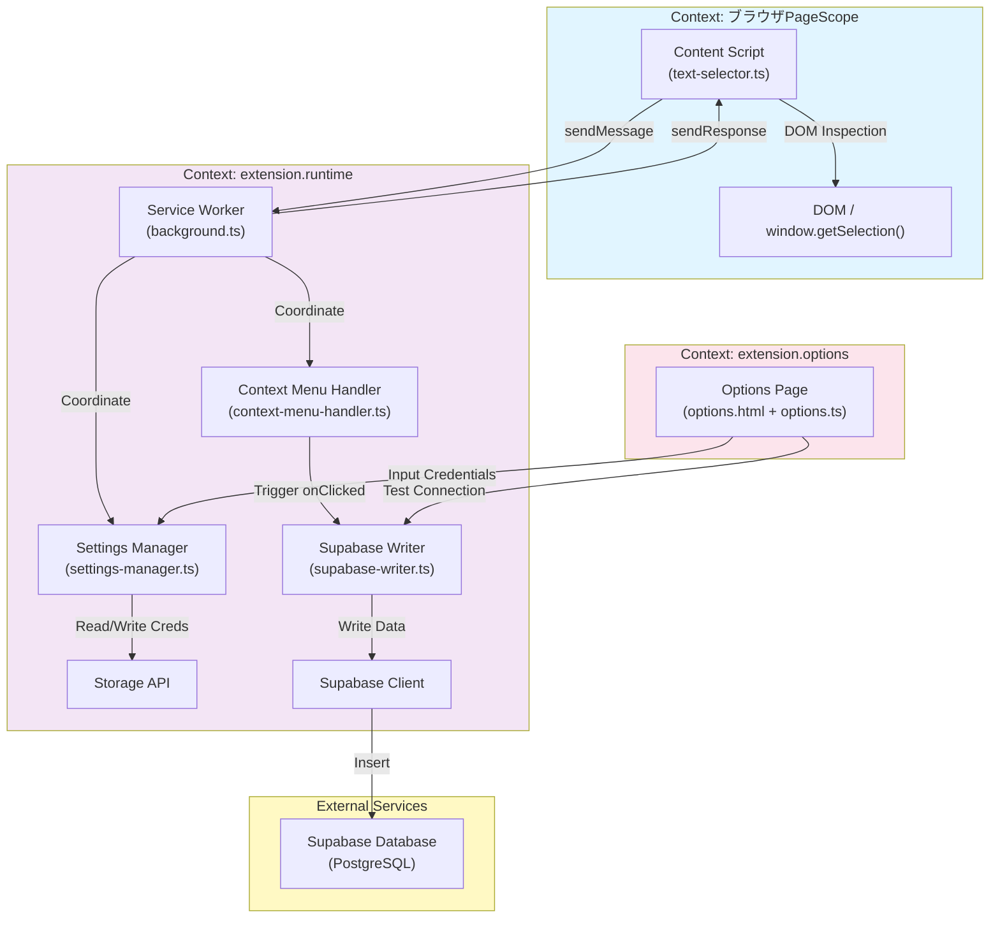
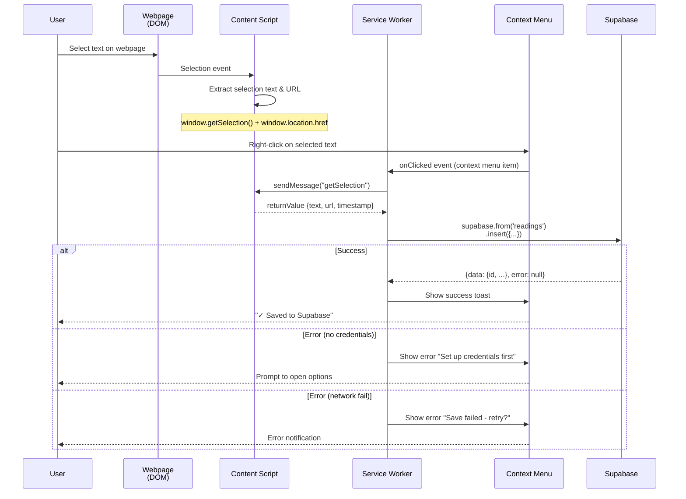

# Design Document

## Overview

本設計は、ブラウザ（Chrome）でWebページを閲覧するユーザーが、重要なテキストを選択してコンテキストメニューから「Save to Supabase」を実行するだけで、そのURLと選択テキストが自動的にSupa baseのユーザープロジェクトに記録されることを実現します。

拡張機能は3つの主要な領置（Content Script、Service Worker、Options Page）に分かれており、以下の責務を明確に分離しています：
- **Content Script**: ページ上のテキスト選択検知
- **Service Worker**: 拡張機能API・ストレージ・Supabase通信の一元管理
- **Options Page**: ユーザーによるSupabase認証情報の入力・保存

### Goals
- Webブログ読者が読み進める中で重要なテキストを素早く記録できる
- 記録したテキストはユーザー自身のSupabaseプロジェクトに直接蓄積される  
- 認証情報の設定は簡単で、セキュアに保管される
- ユーザーフィードバック（成功/エラー）は明確に提示される

### Non-Goals
- 記録したテキストの可視化・検索・分析機能
- Supabase以外のバックエンドへの対応
- モバイルアプリケーション
- Supabaseプロジェクトの自動作成・テーブル自動生成
- 複数デバイス間の同期

## Boundary Commitments

### This Spec Owns
- ブラウザ上のテキスト選択検知とコンテキストメニュー統合
- 選択テキスト・ページURL・タイムスタンプの Supabase への INSERT 操作
- ユーザー設定画面（Options Page）での Supabase 認証情報の入力・保存・疎通確認
- 保存成功/失敗時のユーザーフィードバック表示
- Chrome Storage API を用いた認証情報の永続化

### Out of Boundary
- Supabase 側のテーブルスキーマ設計・作成（ユーザー責務）
- Row Level Security (RLS) ポリシーの定義（ユーザー責務）
- 記録したデータの検索・可視化・分析
- 複数ユーザーの認可管理
- 拡張機能の自動アップデート、バージョン管理（Chrome Web Store運用）

### Allowed Dependencies
- `@supabase/supabase-js` (v2.39+) — Supabase クライアント
- Chrome Runtime / Storage / ContextMenus API — Manifest V3 標準
- TypeScript / modern JavaScript (ES2020+)

### Revalidation Triggers
以下の変更が行われた場合、本設計に依存する他フェーズ・スペックの再検証が必要：
- Supabase のAPIスキーマ変更（ライブラリ要件の更新）
- Chrome Extension Manifest API の非互換変更
- 認証方法の変更（anon key → User Auth への移行）
- テーブル構造の無効化（ユーザー通知要）

---

## Architecture

### Architecture Pattern & Boundary Map



**Architecture Integration**:
- **Selected Pattern**: Content Script + Service Worker 分離モデル
  - Content Script はページコンテキストで DOM のみアクセス
  - Service Worker は拡張機能APIを一元管理
  - Message passing で安全な通信

- **Domain Boundaries**:
  - Page Domain (Content Script): テキスト選択・URL取得
  - Extension Domain (Service Worker): API呼び出し・ストレージ・Supabase通信
  - Settings Domain (Options Page): ユーザー設定入力

- **Existing Patterns Preserved**: なし（新規機能のため）

- **New Components Rationale**:
  - TextSelector: 選択テキスト検知・イベント通知を一元化
  - ContextMenuHandler: Chrome Context Menu API をラップし、選択状態を追跡
  - SupabaseWriter: Supabase 呼び出しの error handling・retry を集中
  - SettingsManager: Storage の read/write を一元化し、設定の型安全性を確保

- **Steering Compliance**: なし（steering files 未作成）

### Technology Stack

| Layer | Choice / Version | Role in Feature | Notes |
|-------|------------------|-----------------|-------|
| Extension Framework | Chrome Extensions (Manifest V3) | Native APIs for context menu, storage, messaging | Latest security standard |
| Runtime | Chromium-based browsers | All major modern browsers | Extensions run in browser runtime |
| JavaScript | TypeScript + ES2020+ | Type-safe implementation, async/await | Compiled to ES2020 for compatibility |
| Supabase Client | @supabase/supabase-js v2.39+ | PostgreSQL table insert operations | Official Supabase client, type-safe |
| Storage | Chrome Storage API (local) | Persist Supabase credentials (URL + anon key) | 10 MB capacity, scoped to extension |
| Build Tool | webpack / esbuild | Bundle content script & service worker separately | Manifest V3 requires separate entry points |

---

## File Structure Plan

### Directory Structure

```
reading-web-supporter/
├── src/
│   ├── content/
│   │   ├── text-selector.ts          # Content Script: text selection detection
│   │   └── text-selector.test.ts
│   │
│   ├── service-worker/
│   │   ├── background.ts             # Service Worker entry point
│   │   ├── context-menu-handler.ts   # Context menu API integration
│   │   ├── supabase-writer.ts        # Supabase insert operations 
│   │   ├── settings-manager.ts       # Chrome storage for credentials
│   │   ├── message-handler.ts        # Runtime message routing
│   │   └── *.test.ts                 # Unit tests per component
│   │
│   ├── options/
│   │   ├── options.html              # Settings UI
│   │   ├── options.ts                # Settings page logic
│   │   └── options.css               # Settings page styling
│   │
│   ├── types/
│   │   └── types.ts                  # Shared TypeScript types
│   │
│   └── utils/
│       ├── logger.ts                 # Logging utility
│       └── error-handler.ts          # Error handling & user feedback
│
├── public/
│   ├── manifest.json                 # Chrome extension manifest (v3)
│   ├── icons/
│   │   ├── icon-16.png
│   │   ├── icon-48.png
│   │   └── icon-128.png
│   └── options.html                  # Copied from src/options/
│
├── test/
│   └── integration/                  # E2E test scenarios
│
├── webpack.config.js                 # Build config (separate entry points)
├── tsconfig.json
└── package.json

```

### Modified Files
- 本feature は新規開発のため、修正対象なし

---

## System Flows

### Primary Flow: Text Selection & Save to Supabase



**Flow Decisions**:
- テキスト選択は常に監視し、メモリに保持（右クリック時に即座に送信）
- Right-click context menu item が save trigger
- Supabase への送信は Service Worker で実行（Content Script は機密情報をやり取りしない）

---

## Requirements Traceability

| Requirement | Summary | Components | Interfaces | Flows |
|---|---|---|---|---|
| 1.1 | テキスト選択後、右クリックメニューに保存オプション表示 | TextSelector, ContextMenuHandler | Message Contract | Text Selection & Save |
| 1.2 | 保存操作実行時、URL + テキストを Supabase 送信 | SupabaseWriter | Supabase API Contract | Text Selection & Save |
| 1.3 | 保存成功時にユーザーフィードバック表示 | SupabaseWriter, ErrorHandler | Toast/Notification UI | Text Selection & Save (Success path) |
| 1.4 | テキスト未選択時に保存操作を無効化/エラー表示 | ContextMenuHandler, ErrorHandler | Message Contract | Context Menu API (Error handling) |
| 2.1 | 選択テキスト・URL・日時を Supabase テーブルへ記録 | SupabaseWriter | Supabase Data Contract | Text Selection & Save |
| 2.2 | Supabase 書き込み失敗時にエラーメッセージ表示 | SupabaseWriter, ErrorHandler | Error Response | Text Selection & Save (Error path) |
| 2.3 | 認証情報未設定時に設定促進メッセージ表示 | SettingsManager, ErrorHandler | Settings Check | Options Page (Initial state) |
| 3.1 | Supabase 認証情報入力・保存できる設定画面 | SettingsUIComponent | Settings Form Contract | Settings Configuration |
| 3.2 | 保存時に Supabase 疎通確認 | SettingsManager, SupabaseWriter | Connection Test Contract | Settings Configuration |
| 3.3 | 認証情報をブラウザセキュアストレージに永続化 | SettingsManager | Storage Contract | Settings Persistence |
| 3.4 | 認証情報変更時に即座に反映 | SettingsManager | Storage Event Contract | Settings Persistence |
| 3.5 | 認証情報無効時にエラーメッセージ表示 | SettingsManager, SupabaseWriter, ErrorHandler | Auth Error Contract | Settings Configuration (Error) |

---

## Components and Interfaces

### Component Summary

| Component | Domain/Layer | Intent | Req Coverage | Key Dependencies (P0/P1) | Contracts |
|-----------|--------------|--------|--------------|--------------------------|-----------|
| TextSelector | Content Script | Select text detection & capture | 1.1, 1.4 | Page DOM (P0) | Service |
| ContextMenuHandler | Service Worker | Chrome context menu integration | 1.1, 1.3, 1.4 | TextSelector (P0), ErrorHandler (P1) | Service |
| SupabaseWriter | Service Worker | Supabase insert & error handling | 1.2, 1.3, 2.1, 2.2 | @supabase/supabase-js (P0), SettingsManager (P0) | API, Service |
| SettingsManager | Service Worker | Chrome storage for credentials | 2.3, 3.1-3.5 | chrome.storage (P0), SupabaseWriter (P0) | Service, State |
| MessageHandler | Service Worker | Content Script ↔ Service Worker messaging | 1.1, 1.2 | chrome.runtime (P0), TextSelector (P0) | Service |
| ErrorHandler | Utils | User-facing error messages & recovery | 1.3, 1.4, 2.2, 2.3, 3.5 | MessageHandler (P1) | Service |
| SettingsUI | Options Page | HTML form for Supabase credentials | 3.1, 3.2 | SettingsManager (P0), SupabaseWriter (P0) | State |

---

### Service Worker Domain

#### TextSelector
| Field | Detail |
|-------|--------|
| Intent | Content Script でテキスト選択状態を監視し、Service Worker へ通知 |
| Requirements | 1.1, 1.4 |

**Responsibilities & Constraints**
- ページ上の `mouseup` / `touch` イベントでテキスト選択を検知
- 選択テキストが空でないことを確認
- Service Worker にメッセージ送信で選択状態を通知
- テキスト未選択時も通知（Service Worker で UI 無効化判定）

**Dependencies**
- Inbound: Page DOM — `window.getSelection()` 呼び出し (P0)
- Outbound: なし

**Contracts**: Service [ ✓ ] / API [ ] / Event [ ] / Batch [ ] / State [ ]

##### Service Interface
```typescript
interface TextSelectionMessage {
  type: 'textSelectionUpdated';
  payload: {
    selectedText: string;      // window.getSelection().toString()
    pageUrl: string;           // window.location.href
    hasSelection: boolean;     // selectedText.length > 0
  };
}
```

**Implementation Notes**
- Content Script はページ側に注入されるため、`window.getSelection()` の呼び出しは安全
- 性能最適化: debounce（250ms） で頻繁な通知を抑止
- XSS 対策: Service Worker 側で selector 値のサニタイズは不要（string のみ）

---

#### ContextMenuHandler
| Field | Detail |
|-------|--------|
| Intent | Chrome Context Menu API を統合し、「Save to Supabase」メニュー項目を管理 |
| Requirements | 1.1, 1.3, 1.4 |

**Responsibilities & Constraints**
- Service Worker 起動時に context menu item を登録（`chrome.contextMenus.create()`）
- ユーザーが context menu item をクリック → `onClicked` イベント発火
- メニュークリック時に、現在の選択テキストが有効か確認
- TextSelector から受け取った選択情報を SupabaseWriter へ渡す
- SupabaseWriter の成功/失敗を検知して、ErrorHandler でユーザーフィードバック

**Dependencies**
- Inbound: TextSelector (message receiving) — 選択状態通知 (P0)
- Inbound: chrome.contextMenus API — context menu lifecycle (P0)
- Outbound: SupabaseWriter — save operation 実行 (P0)
- Outbound: ErrorHandler — error notification (P1)

**Contracts**: Service [ ✓ ] / API [ ] / Event [ ] / Batch [ ] / State [ ]

##### Service Interface
```typescript
interface ContextMenuData {
  parentMenuId?: string;
  id: 'save-to-supabase';
  title: 'Save to Supabase';
  contexts: ['selection'];    // Only show on text selection
  documentUrlPatterns: ['<all_urls>'];
}

interface OnClickedInfo {
  menuItemId: string;
  selectionText: string;      // User-selected text from page
  pageUrl: string;
}
```

**Preconditions**:
- Service Worker が起動している
- TextSelector が初期化済み

**Postconditions**:
- メニュークリック → SupabaseWriter の insert operation へ
- 成功/失敗 → ErrorHandler で通知

**Implementation Notes**
- Manifest V3 では context menu item の `enabled/disabled` は動的に変更可能
- TextSelector から選択なし通知を受け取った時点で、menu item を disabled 状態に（UX 向上）

---

#### SupabaseWriter
| Field | Detail |
|-------|--------|
| Intent | Supabase へのデータ insert と error handling を一元管理 |
| Requirements | 1.2, 1.3, 2.1, 2.2 |

**Responsibilities & Constraints**
- Supabase クライアント initialization（SettingsManager から URL + key を取得）
- 選択テキスト・URL・タイムスタンプを Supabase テーブルへ insert
- insert 失敗時（network error、auth error、query error）を判定
- エラーの種類に応じた recovery suggest を ErrorHandler へ
- 重複送信対策（ローカル deduplication queue）

**Dependencies**
- Inbound: ContextMenuHandler — save trigger (P0)
- Inbound: SettingsManager — Supabase credentials (P0)
- Outbound: @supabase/supabase-js API — insert operation (P0)
- Outbound: ErrorHandler — error notification (P1)

**Contracts**: Service [ ✓ ] / API [ ] / Event [ ] / Batch [ ] / State [ ]

##### Service Interface
```typescript
interface SaveTextOptions {
  selectedText: string;
  pageUrl: string;
  timestamp: ISO8601;         // e.g., new Date().toISOString()
}

interface SaveResult {
  success: boolean;
  data?: {
    id: string;
    created_at: ISO8601;
  };
  error?: {
    code: 'NO_CREDENTIALS' | 'AUTH_FAILED' | 'NETWORK_ERROR' | 'DB_ERROR' | 'UNKNOWN';
    message: string;
    recoveryHint: string;
  };
}

interface SupabaseWriterService {
  save(options: SaveTextOptions): Promise<SaveResult>;
  testConnection(): Promise<{success: boolean; message: string}>;
}
```

**Preconditions**:
- SettingsManager に Supabase URL + anon key が設定済み
- Supabase テーブル（`readings`）が存在し、columns: `selected_text`, `page_url`, `created_at`

**Postconditions**:
- 成功: Supabase テーブルへ 1 行 insert
- 失敗: error object に詳細を格納 → ErrorHandler が ユーザーに通知

**Invariants**:
- 同一テキスト・URL・タイムスタンプ の重複 insert を防止（ローカル dedup キューで未送信分を追跡）

**Implementation Notes**
- Network retry: exponential backoff (1s, 2s, 4s…) で最大 3 回再試行
- Batch insert は未実装（単一 record insert のみ）
- Timeout: 10s 以上応答なければ NETWORK_ERROR と判定
- Supabase RLS により、anon key では「不正なテーブル書き込み」を  blocked 可能（設計上、RLS はユーザーが設定する責務）

---

#### SettingsManager
| Field | Detail |
|-------|--------|
| Intent | Supabase 認証情報（URL + anon key）の読み書き・永続化・検証 |
| Requirements | 2.3, 3.1, 3.2, 3.3, 3.4, 3.5 |

**Responsibilities & Constraints**
- `chrome.storage.local` への credentials 保存/読み込み
- Options Page から credentials を受け取り、型検証後に保存
- 保存時に SupabaseWriter の `testConnection()` を実行
- 無効な credentials を検出した場合は error を返す
- SettingsManager の状態変化を notification（chrome.runtime.sendMessage）で通知

**Dependencies**
- Inbound: Options Page — user input (P0)
- Inbound: chrome.storage API — persistence (P0)
- Outbound: SupabaseWriter — testConnection() (P0)
- Outbound: MessageHandler — state change notification (P1)

**Contracts**: Service [ ✓ ] / API [ ] / Event [ ] / Batch [ ✓ ] / State [ ✓ ]

##### Service Interface
```typescript
interface SupabaseCredentials {
  projectUrl: string;      // e.g., https://xxx.supabase.co
  anonKey: string;         // Public role API key
}

interface SettingsManagerService {
  getCredentials(): Promise<SupabaseCredentials | null>;
  setCredentials(creds: SupabaseCredentials): Promise<{success: boolean; error?: string}>;
  isConfigured(): Promise<boolean>;
  testConnection(): Promise<{success: boolean; message: string}>;
}
```

##### State Management
```typescript
interface StorageState {
  supabse_credentials: {
    projectUrl: string;
    anonKey: string;
    lastVerified: ISO8601;   // Last successful connection test
  } | null;
}
```

**Preconditions**:
- Chrome Storage API が利用可能
- Users が Options Page で credentials を入力

**Postconditions**:
- 保存成功: `chrome.storage.local` に credentials が格納
- 検証失敗: error を返し、storage には保存しない

**Implementation Notes**
- Validation: `projectUrl` は HTTPS URL形式、`anonKey` は 40+ characters
- Security: anon key は localStorage に保存してもよい（RLS で保護）
- Migration: 将来的に User Auth へ移行する場合、legacy credentials の削除ロジックを追加

---

#### MessageHandler
| Field | Detail |
|-------|--------|
| Intent | Content Script ↔ Service Worker 間の message routing と request/response 管理 |
| Requirements | 1.1, 1.2 |

**Implementation Notes**
- Centralized `chrome.runtime.onMessage` handler in background.ts
- RoutingMap: message type ごとに handler を dispatch
- TextSelector から定期的に selection state を送信 → ContextMenuHandler が判定

---

### Options Page Domain

#### SettingsUI
| Field | Detail |
|-------|--------|
| Intent | ユーザーが Supabase 認証情報を入力・テスト・保存できる HTML フォーム |
| Requirements | 3.1, 3.2 |

**Responsibilities & Constraints**
- 2 つの入力フィールド: Supabase Project URL、Anon Key
- 「Save」ボタン: SettingsManager へ credentials 送信
- 「Test Connection」ボタン: SupabaseWriter へ testConnection() 要求
- 成功/失敗メッセージを画面に表示
- 既存 credentials がある場合は、フィールドに事前入力

**Implementation Notes**
- HTML は 簡潔に：form + 2 input + 2 button + status div
- CSS: Chrome extension options ページのデフォルトスタル
- JavaScript: options.ts で SettingsManager の API を呼び出し
- UX: 入力後、自動的に validation → save の流れ

---

## Data Models

### Domain Model

```
Aggregate: ReadingRecord
  - Entity: id (UUID)
  - Value Objects:
    - selectedText: string (non-empty)
    - pageUrl: string (URL)
    - timestamp: ISO8601
  - Business Invariants:
    - selectedText と pageUrl は同時に記録される
    - 記録日時は自動生成（ユーザー入力なし）
```

### Logical Data Model

**Table: readings**

| Column | Type | Constraints | Notes |
|--------|------|-------------|-------|
| id | UUID | PRIMARY KEY, DEFAULT uuid() | Auto-generated ID |
| selected_text | TEXT | NOT NULL | User-selected text from webpage |
| page_url | VARCHAR(2048) | NOT NULL | Full URL where text was selected |
| created_at | TIMESTAMP | NOT NULL, DEFAULT NOW() | Insert timestamp |
| user_id | UUID | (Optional) | For future User Auth support |

**Indexes**:
- `(user_id, created_at DESC)` — ユーザー別・時系列ソート

**Consistency**:
- No foreign keys （ユーザー管理は Supabase RLS に委譲）
- No cascading rules （delete は直接テーブル操作のみ）

### Physical Data Model
PostgreSQL テーブル定義 (ユーザーが別途作成)：

```sql
CREATE TABLE readings (
  id UUID DEFAULT uuid() PRIMARY KEY,
  selected_text TEXT NOT NULL,
  page_url VARCHAR(2048) NOT NULL,
  created_at TIMESTAMP DEFAULT NOW() NOT NULL
);

CREATE INDEX idx_readings_created_at ON readings(created_at DESC);
ENABLE ROW LEVEL SECURITY ON readings;

-- Example RLS policy: anon role は INSERT のみ可能
CREATE POLICY readings_anon_insert ON readings 
  FOR INSERT WITH CHECK (true);
```

---

## Error Handling

### Error Strategy

| Error Type | Source | User Action | System Response |
|---|---|---|---|
| **No Credentials** | Service Worker | None (setup required) | Prompt to open Options page |
| **Invalid URL Format** | Options Page | Retry input | Show field-level error (client-side validation) |
| **Network Timeout** | Supabase API | Retry save | Show "Network error. Retry?" + auto-retry after 3s |
| **Auth Failed (invalid key)** | Supabase API | Re-enter credentials | Show "Invalid Supabase key. Check in Options." |
| **DB Error (RLS denied)** | Supabase RLS | Contact admin | Show "Access denied. Check Supabase RLS policy." |
| **Unknown Error** | Any | Retry or report | Show "Unexpected error. Please try again." + error code |

### Error Categories and Responses

**User Errors (4xx)**:
- Invalid Supabase URL format → Field validation on Options page
- Missing/empty credentials → Init dialog at extension startup

**System Errors (5xx)**:
- Network failure → Exponential backoff retry (3 attempts)
- Supabase service down → Graceful error message + suggestion to retry later

**Business Logic Errors (422)**:
- RLS policy blocks insert → "Access denied. Check your Supabase RLS policy." + details link

### Monitoring

| Event | Logging | Metrics |
|---|---|---|
| Save initiated | INFO: "Saving selection..." | counter: save.requests |
| Save successful | INFO: "Successfully saved to Supabase" | counter: save.success, histogram: save.latency_ms |
| Save failed | ERROR: "Save failed: {error code}" | counter: save.failures, tag: error_type |
| Credentials invalid | WARN: "Supabase credentials invalid" | counter: auth.failures |

---

## Testing Strategy

### Unit Tests
1. **TextSelector**: Selection detection with debounce
   - Test: `selectedText` extraction from `window.getSelection()`
   - Test: debounce behavior (250ms)
   - Test: empty selection handling

2. **ContextMenuHandler**: Menu creation and click event
   - Test: `chrome.contextMenus.create()` called on init
   - Test: `onClicked` event triggers save
   - Test: disabled state when no selection

3. **SupabaseWriter**: Insert operations and error handling
   - Test: successful insert (mock Supabase)
   - Test: network error + retry logic (3 attempts)
   - Test: auth error handling

4. **SettingsManager**: Credentials CRUD and validation
   - Test: save/load from chrome.storage.local
   - Test: connection test (success/failure)
   - Test: credentials validation (URL format, key format)

### Integration Tests
1. **End-to-End (E2E): Text Selection → Save → Supabase**
   - Setup: Live Supabase test project with anon key
   - Flow: Select text → right-click → click menu → verify DB insert
   - Cleanup: Delete test records

2. **Settings Configuration → Connection Test → Save**
   - Flow: Enter credentials → test connection → save
   - Verify: Credentials in chrome.storage.local

3. **Error Recovery**
   - Scenario: Network timeout → retry → success
   - Scenario: Invalid key → error → re-enter → success

### E2E/UI Tests
1. **Chrome Extension Manifest**:
   - Verify: manifest.json structure (v3 compatible)
   - Verify: content_scripts injection on all_urls
   - Verify: service_worker registration

2. **UI Flow**:
   - Select text on webpage → context menu appears
   - Click "Save to Supabase" → toast shows status
   - Options page loads → fields pre-populated with existing credentials
   - Test Connection button → network request → result display

---

## Optional Sections

### Security Considerations

**Threat Model**:
- **Code Injection**: Content Script の `eval()` 使用なし（CSP で禁止）
- **API Key Exposure**: anon key は公開前提だが、RLS で制限
- **CSRF**: chrome.runtime.sendMessage はオリジン検証済み
- **XSS**: SupabaseWriter は selectedText をそのまま送信（client→server）。Supabase RLS が filter

**Authentication & Authorization**:
- Anon Key: Supabase RLS により、INSERT のみ可能（SELECT/UPDATE/DELETE は RLS で deny）
- User Management: 本 spec では User Auth 未実装（future scope）

**Data Protection**:
- Transport: Supabase 側が HTTPS 必須
- Storage: chrome.storage.local の credentials は暗号化（Chrome OS 側）
- At Rest: Supabase PostgreSQL の encryption-at-rest

**Privacy Considerations**:
- Selected text は ユーザーの Supabase プロジェクトに直接保存
- 拡張機能は他の plugin/extension とデータを共有しない
- Privacy Policy: 拡張機能が data を collect → ユーザーのプロジェクトにのみ保存

### Performance & Scalability

**Target Metrics**:
- Save latency: < 2s (network + Supabase processing)
- Memory footprint: < 5 MB (chrome.storage.local capacity)
- Context menu render: < 100ms after right-click

**Caching**:
- Credentials caching: chrome.storage.local で永続化（app restart でも再取得不要）
- Supabase client: singleton instance in Service Worker

**Scaling**:
- Batch insert: 未実装（単一record のみ）
- Future: bulk insert API 検討（user が複数 records 一括保存）

---

