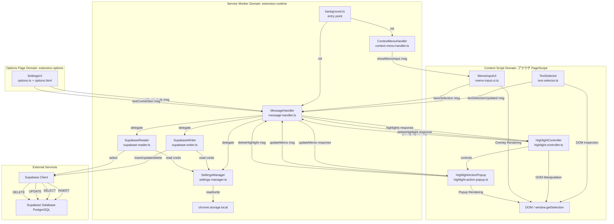
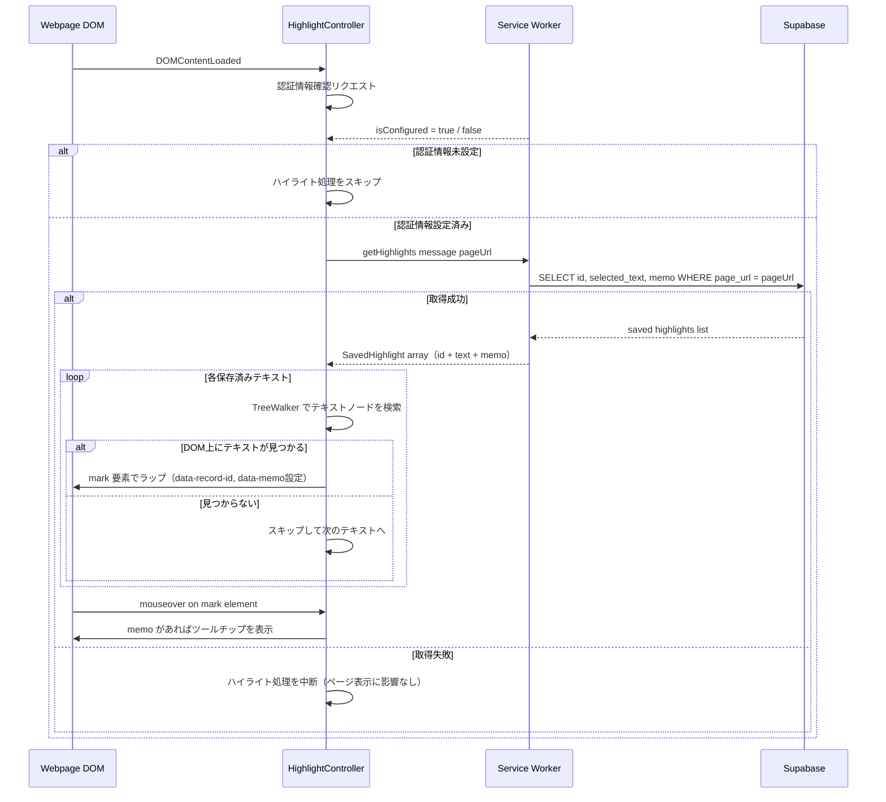
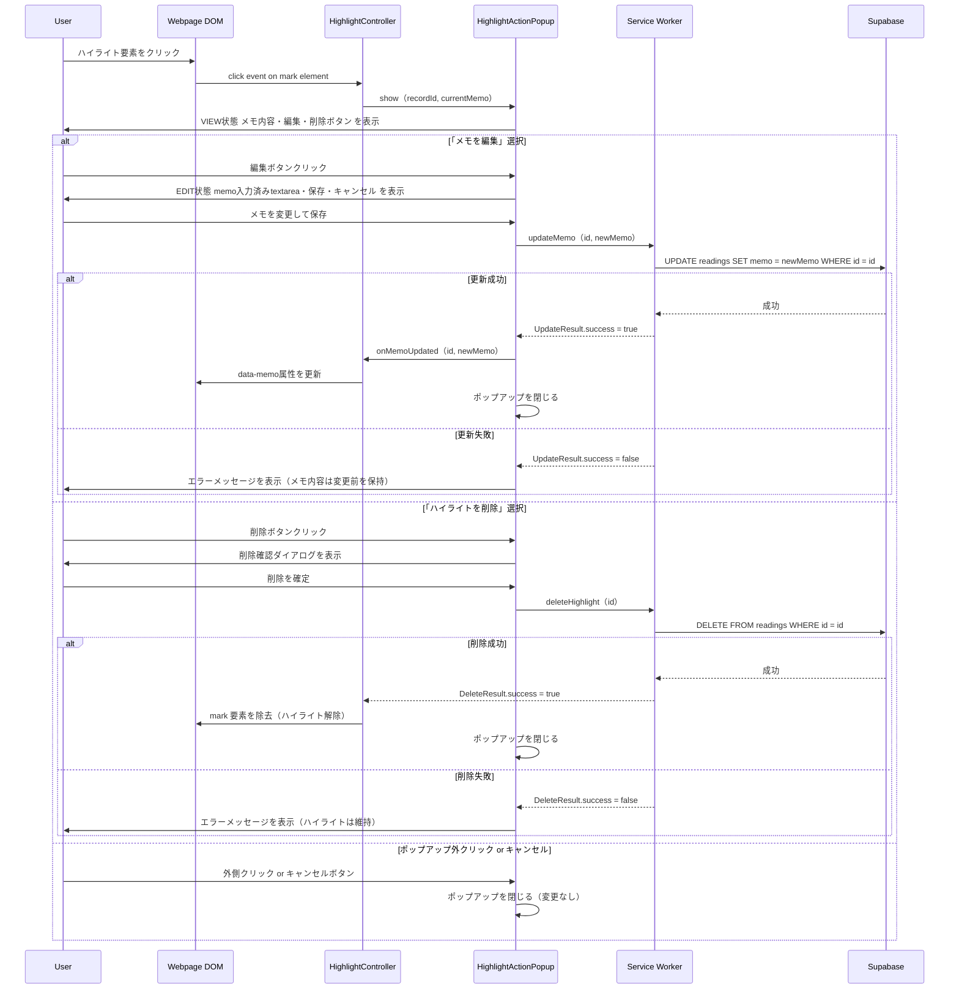

# Design Document

## Overview

本設計は、ブラウザ（Chrome）でWebページを閲覧するユーザーが、重要なテキストを選択してコンテキストメニューから「ハイライトしてメモを保存」を実行するだけで、そのURLと選択テキストが自動的にユーザー自身のSupabaseプロジェクトに記録されることを実現します。保存時には任意のメモを付加でき、記録の背景や感想を残せます。さらに、過去に保存したテキストを含むページを開いた際に、該当箇所が自動的にハイライト表示され、メモが設定されている場合はホバー時にツールチップで表示されます。ハイライトをクリックすることで、メモの編集や不要なハイライトの削除も行えます。

拡張機能は6つの主要な領域（Content Script、Service Worker、Options Page、Highlight機能、MemoInput機能、HighlightAction機能）に分かれており、以下の責務を明確に分離しています：
- **Content Script（TextSelector）**: ページ上のテキスト選択検知と通知
- **Content Script（MemoInputUI）**: メモ入力オーバーレイUIの表示と保存メッセージ送信
- **Content Script（HighlightController）**: 保存済みテキストのDOM上ハイライト表示・メモツールチップ表示・HighlightActionPopup制御
- **Content Script（HighlightActionPopup）**: ハイライトクリック時のメモ表示・編集・削除UI
- **Service Worker**: 拡張機能API・ストレージ・Supabase通信（INSERT/SELECT/UPDATE/DELETE）の一元管理
- **Options Page**: ユーザーによるSupabase認証情報の入力・保存

### Goals
- Webブログ読者が読み進める中で重要なテキストを素早く記録できる
- コンテキストメニューのラベルでハイライト保存＋メモ付加の機能が直感的に伝わる
- テキスト保存時に任意のメモを付加して記録の背景・感想を残せる
- 記録したテキストはユーザー自身のSupabaseプロジェクトに直接蓄積される
- 認証情報の設定は簡単で、セキュアに保管される
- ユーザーフィードバック（成功/エラー）は明確に提示される
- 過去に保存したテキストをページ上でひと目で把握でき、メモもホバーで確認できる
- 保存済みハイライトのメモを後から編集でき、不要なハイライトを削除できる

### Non-Goals
- 記録したテキストの可視化・検索・分析機能
- Supabase以外のバックエンドへの対応
- モバイルアプリケーション
- Supabaseプロジェクトの自動作成・テーブル自動生成
- 複数デバイス間の同期
- ハイライトのスタイル（色・太さ等）のユーザーカスタマイズ

## Boundary Commitments

### This Spec Owns
- ブラウザ上のテキスト選択検知とコンテキストメニュー統合
- コンテキストメニューラベル「ハイライトしてメモを保存」の表示
- メモ入力オーバーレイUIの表示・ユーザー入力収集・保存トリガー
- 選択テキスト・ページURL・メモ（任意）・タイムスタンプの Supabase への INSERT 操作
- ページロード時の保存済みテキスト取得（Supabase SELECT）とDOM上ハイライト表示
- ハイライト要素へのホバー時メモツールチップ表示
- ハイライト要素へのクリック時アクションポップアップ表示（メモ表示・編集・削除）
- 保存済みメモの編集（Supabase UPDATE）とハイライトへの即時反映
- 不要なハイライトの削除（Supabase DELETE）とDOM上のハイライト除去
- ユーザー設定画面（Options Page）での Supabase 認証情報の入力・保存・疎通確認
- 保存・編集・削除の成功/失敗時のユーザーフィードバック表示
- Chrome Storage API を用いた認証情報の永続化

### Out of Boundary
- Supabase 側のテーブルスキーマ設計・作成（ユーザー責務）
- Row Level Security (RLS) ポリシーの定義（ユーザー責務）
- 記録したデータの一覧閲覧・検索・可視化・分析
- 複数ユーザーの認可管理
- 拡張機能の自動アップデート、バージョン管理（Chrome Web Store運用）

### Allowed Dependencies
- `@supabase/supabase-js` (v2.39+) — Supabase クライアント（INSERT/SELECT/UPDATE/DELETE）
- Chrome Runtime / Storage / ContextMenus API — Manifest V3 標準
- TypeScript / modern JavaScript (ES2020+)
- ブラウザ標準 DOM API（TreeWalker、Range）— ハイライト実装用

### Revalidation Triggers
以下の変更が行われた場合、本設計に依存する他フェーズ・スペックの再検証が必要：
- Supabase の API スキーマ変更（ライブラリ要件の更新）
- Chrome Extension Manifest API の非互換変更
- 認証方法の変更（anon key → User Auth への移行）
- テーブル構造の変更（`id`・`selected_text`・`page_url`・`memo` カラム名変更）
- ハイライト表示に使用する CSS クラス名の変更
- `SavedHighlight` インターフェース形状の変更（`HighlightController`・`SupabaseReader`・`HighlightActionPopup` 間の共有型）

---

## Architecture

### Architecture Pattern & Boundary Map



**Architecture Integration**:
- **Selected Pattern**: Content Script + Service Worker 分離モデル（既存パターン踏襲）
- **Domain Boundaries**:
  - Content Script Domain: テキスト選択・URL取得、メモ入力UI、DOM ハイライト操作、ハイライトアクションPopup
  - Service Worker Domain: 拡張機能 API・Supabase 通信（INSERT/SELECT/UPDATE/DELETE）・ストレージ管理
  - Options Page Domain: ユーザー設定入力
- **New Components Rationale**:
  - HighlightActionPopup: クリック時のメモ表示・編集・削除操作はページコンテキスト専用のため Content Script に追加。MemoInputUIと同パターン（Shadow DOM）でView/Editの2ステートを1コンポーネントで管理
- **Edit/Delete Flow**: HighlightController がクリックイベントを検知し HighlightActionPopup を開く。編集保存時は `updateMemo` メッセージを SW へ送信して HighlightController 経由で DOM を更新。削除確認後は `deleteHighlight` メッセージを送信して HighlightController が `<mark>` 要素を除去する

### Technology Stack

| Layer | Choice / Version | Role in Feature | Notes |
|-------|------------------|-----------------|-------|
| Extension Framework | Chrome Extensions Manifest V3 | Context menu, storage, messaging | 最新セキュリティ標準 |
| JavaScript | TypeScript + ES2020+ | 型安全実装、async/await | ES2020 コンパイル対象 |
| Supabase Client | @supabase/supabase-js v2.39+ | INSERT・SELECT・UPDATE・DELETE 操作 | 公式クライアント、型安全 |
| Storage | Chrome Storage API local | Supabase 認証情報の永続化 | 10 MB 容量、拡張機能スコープ |
| DOM API | Browser native TreeWalker + Range | ハイライト DOM 操作・ツールチップ表示 | ライブラリ不要 |
| Build Tool | webpack / esbuild | Content Script と SW を別バンドル | Manifest V3 複数エントリポイント |

---

## File Structure Plan

### Directory Structure

```
reading-web-supporter/
├── src/
│   ├── content/
│   │   ├── text-selector.ts              # Content Script: テキスト選択検知・通知
│   │   ├── text-selector.test.ts
│   │   ├── memo-input-ui.ts              # Content Script: メモ入力オーバーレイUI
│   │   ├── memo-input-ui.test.ts
│   │   ├── highlight-controller.ts       # Content Script: ハイライト表示・ツールチップ・HighlightActionPopup制御 (更新)
│   │   ├── highlight-controller.test.ts
│   │   ├── highlight-action-popup.ts     # Content Script: ハイライトクリック時のメモ表示・編集・削除UI (新規)
│   │   └── highlight-action-popup.test.ts
│   │
│   ├── service-worker/
│   │   ├── background.ts                 # Service Worker エントリポイント
│   │   ├── context-menu-handler.ts       # Context Menu API 統合 (更新: ラベル変更)
│   │   ├── supabase-writer.ts            # Supabase INSERT/UPDATE/DELETE 操作 (更新: updateMemo/deleteRecord追加)
│   │   ├── supabase-reader.ts            # Supabase SELECT 操作 (更新: id取得追加)
│   │   ├── settings-manager.ts           # Chrome storage 認証情報管理
│   │   ├── message-handler.ts            # Runtime メッセージルーティング (更新: updateMemo/deleteHighlight追加)
│   │   └── *.test.ts
│   │
│   ├── options/
│   │   ├── options.html                  # 設定 UI
│   │   ├── options.ts                    # 設定ページロジック
│   │   └── options.css
│   │
│   ├── types/
│   │   └── types.ts                      # 共有 TypeScript 型定義 (更新: SavedHighlight.id追加, 新メッセージ型)
│   │
│   └── utils/
│       ├── logger.ts
│       └── error-handler.ts
│
├── public/
│   ├── manifest.json                     # Chrome extension manifest v3
│   └── icons/
│
├── test/
│   └── integration/
│
├── webpack.config.js
├── tsconfig.json
└── package.json
```

### Modified Files
- `src/types/types.ts` — `SavedHighlight` に `id: string` 追加、`UpdateMemoMessage`・`DeleteHighlightMessage` を `ExtensionMessage` 共用体に追加
- `src/service-worker/context-menu-handler.ts` — メニューラベルを「ハイライトしてメモを保存」に変更
- `src/service-worker/supabase-writer.ts` — `updateMemo(id, memo)` と `deleteRecord(id)` メソッドを追加
- `src/service-worker/supabase-reader.ts` — `id` カラムを SELECT に追加、`SavedHighlight.id` を返却
- `src/service-worker/message-handler.ts` — `updateMemo`・`deleteHighlight` ハンドラを追加
- `src/content/highlight-controller.ts` — `<mark>` クリック処理追加・HighlightActionPopup 制御・削除後 DOM 除去・編集後 `data-memo` 更新

### New Files
- `src/content/highlight-action-popup.ts` — ハイライトクリック時のメモ表示（VIEW）・編集（EDIT）・削除確認UIをShadow DOMで実装

---

## System Flows

### Primary Flow: Text Selection → Memo Input → Save to Supabase


**Flow Decisions**:
- コンテキストメニューラベルは「ハイライトしてメモを保存」（1.1）
- メモ入力は任意（空のまま Save しても保存される）（1.2）
- Cancel 時は保存処理を実行しない

### Flow: Page Load → Highlight → Tooltip on Hover



### New Flow: Highlight Click → Memo Edit / Delete



---

## Requirements Traceability

| Requirement | Summary | Components | Interfaces | Flows |
|---|---|---|---|---|
| 1.1 | コンテキストメニューに「ハイライトしてメモを保存」を表示 | TextSelector, ContextMenuHandler | TextSelectionMessage | Primary Flow |
| 1.2 | 保存操作実行時にメモ入力UIを表示し確定後にSupabase送信 | MemoInputUI, SupabaseWriter | SaveTextOptions | Primary Flow |
| 1.3 | 保存成功時にユーザーフィードバック表示 | SupabaseWriter, ErrorHandler | SaveResult | Primary Flow (Success) |
| 1.4 | テキスト未選択時に保存操作を無効化/エラー表示 | ContextMenuHandler, ErrorHandler | TextSelectionMessage | Primary Flow (Error) |
| 2.1 | 選択テキスト・URL・日時を Supabase テーブルへ記録 | SupabaseWriter | SaveTextOptions | Primary Flow |
| 2.2 | Supabase 書き込み失敗時にエラーメッセージ表示 | SupabaseWriter, ErrorHandler | SaveResult | Primary Flow (Error) |
| 2.3 | 認証情報未設定時に設定促進メッセージ表示 | SettingsManager, ErrorHandler | SettingsManagerService | Primary Flow (Error) |
| 3.1 | Supabase 認証情報入力・保存できる設定画面 | SettingsUI | Settings Form | Settings Configuration |
| 3.2 | 保存時に Supabase 疎通確認 | SettingsManager, SupabaseWriter | testConnection | Settings Configuration |
| 3.3 | 認証情報をブラウザセキュアストレージに永続化 | SettingsManager | StorageState | Settings Persistence |
| 3.4 | 認証情報変更時に即座に反映 | SettingsManager | Storage Event | Settings Persistence |
| 3.5 | 認証情報無効時にエラーメッセージ表示 | SettingsManager, SupabaseWriter, ErrorHandler | SaveResult | Settings Configuration (Error) |
| 4.1 | ページロード時、保存済みテキストを Supabase から取得 | HighlightController, SupabaseReader | GetHighlightsMessage | Highlight Flow |
| 4.2 | 保存済みテキストをページ上でハイライト表示 | HighlightController | HighlightsResponse | Highlight Flow |
| 4.3 | 複数の保存済みテキストをすべてハイライト表示 | HighlightController | HighlightsResponse | Highlight Flow |
| 4.4 | DOM 上に見つからない場合はスキップして継続 | HighlightController | — | Highlight Flow |
| 4.5 | Supabase 取得失敗時はページ表示を妨げず中断 | HighlightController, SupabaseReader | HighlightsResponse | Highlight Flow |
| 4.6 | 認証情報未設定時はハイライト取得処理を実行しない | HighlightController, SettingsManager | isConfigured | Highlight Flow |
| 5.1 | 保存操作実行時にメモ入力UIを表示 | MemoInputUI, ContextMenuHandler | ShowMemoInputMessage | Primary Flow |
| 5.2 | メモ・選択テキスト・URL・日時を Supabase へ書き込む | MemoInputUI, SupabaseWriter | SaveTextOptions | Primary Flow |
| 5.3 | メモ入力は任意（メモなしでも保存可能） | MemoInputUI, SupabaseWriter | SaveTextOptions.memo | Primary Flow |
| 5.4 | ハイライトホバー時にメモをツールチップ表示 | HighlightController | SavedHighlight | Highlight Flow |
| 5.5 | メモ未入力時はツールチップ表示を省略 | HighlightController | SavedHighlight.memo | Highlight Flow |
| 6.1 | ハイライトクリック時にメモ・編集・削除ボタンのポップアップを表示 | HighlightController, HighlightActionPopup | HighlightActionPopupService | Edit/Delete Flow |
| 6.2 | 「メモを編集」選択時に既存メモ入力済みの編集UIを表示 | HighlightActionPopup | HighlightActionPopupService | Edit/Delete Flow |
| 6.3 | メモ編集保存時に保存先に反映しツールチップを即座に更新 | HighlightActionPopup, SupabaseWriter, HighlightController | UpdateMemoMessage, UpdateResult | Edit/Delete Flow |
| 6.4 | 「ハイライトを削除」選択時に確認後、保存データを削除しDOM除去 | HighlightActionPopup, SupabaseWriter, HighlightController | DeleteHighlightMessage, DeleteResult | Edit/Delete Flow |
| 6.5 | 更新・削除失敗時にエラーメッセージを表示し状態を保持 | HighlightActionPopup, SupabaseWriter, ErrorHandler | UpdateResult, DeleteResult | Edit/Delete Flow (Error) |
| 6.6 | ポップアップ外クリックでポップアップを閉じ変更を保存しない | HighlightActionPopup | — | Edit/Delete Flow |

---

## Components and Interfaces

### Component Summary

| Component | Domain/Layer | Intent | Req Coverage | Key Dependencies (P0/P1) | Contracts |
|-----------|--------------|--------|--------------|--------------------------|-----------|
| TextSelector | Content Script | テキスト選択状態の監視と SW への通知 | 1.1, 1.4 | Page DOM (P0) | Service |
| MemoInputUI | Content Script | メモ入力オーバーレイUIの表示と保存メッセージ送信 | 5.1, 5.2, 5.3 | MessageHandler (P0), DOM (P0) | Service |
| HighlightController | Content Script | 保存済みテキストのハイライト表示・メモツールチップ・HighlightActionPopup制御 | 4.1–4.6, 5.4, 5.5, 6.1, 6.3, 6.4 | MessageHandler (P0), DOM (P0), HighlightActionPopup (P0) | Service |
| HighlightActionPopup | Content Script | ハイライトクリック時のメモ表示・編集・削除UI | 6.1–6.6 | MessageHandler (P0), DOM (P0) | Service |
| ContextMenuHandler | Service Worker | Chrome Context Menu API 統合・MemoInputUI起動 | 1.1, 1.3, 1.4 | TextSelector (P0), ErrorHandler (P1) | Service |
| SupabaseWriter | Service Worker | Supabase INSERT/UPDATE/DELETE と error handling | 1.2, 1.3, 2.1, 2.2, 5.2, 5.3, 6.3, 6.4, 6.5 | @supabase/supabase-js (P0), SettingsManager (P0) | Service |
| SupabaseReader | Service Worker | Supabase SELECT（保存済みテキスト・メモ・ID取得） | 4.1, 4.5 | @supabase/supabase-js (P0), SettingsManager (P0) | Service |
| SettingsManager | Service Worker | Chrome storage 認証情報管理 | 2.3, 3.1–3.5, 4.6 | chrome.storage (P0), SupabaseWriter (P0) | Service, State |
| MessageHandler | Service Worker | Content Script ↔ SW メッセージルーティング | 1.1, 1.2, 4.1, 5.1, 6.3, 6.4 | chrome.runtime (P0) | Service |
| ErrorHandler | Utils | ユーザー向けエラーメッセージ | 1.3, 1.4, 2.2, 2.3, 3.5, 6.5 | MessageHandler (P1) | Service |
| SettingsUI | Options Page | Supabase 認証情報入力フォーム | 3.1, 3.2 | SettingsManager (P0) | State |

---

### Content Script Domain

#### TextSelector
（設計変更なし。要件1.1, 1.4 をカバー。）

##### Service Interface
```typescript
interface TextSelectionMessage {
  type: 'textSelectionUpdated';
  payload: {
    selectedText: string;
    pageUrl: string;
    hasSelection: boolean;
  };
}
```

---

#### MemoInputUI
| Field | Detail |
|-------|--------|
| Intent | メモ入力オーバーレイUI の表示・ユーザー入力収集・保存メッセージの送信 |
| Requirements | 5.1, 5.2, 5.3 |

**Responsibilities & Constraints**
- `showMemoInput` メッセージ受信時にページ上にオーバーレイダイアログを表示する（5.1）
- 選択テキストのプレビューと `<textarea>` によるメモ入力フィールドを提供する
- Save ボタン押下時に `saveSelection` メッセージを SW へ送信する（memo は空文字 or 入力値）（5.2, 5.3）
- Cancel ボタン押下時はダイアログを閉じ、保存処理を実行しない
- オーバーレイは最前面に表示し、背景クリックで Cancel と同等の動作
- Shadow DOM でページスタイルと分離する

**Dependencies**
- Inbound: ContextMenuHandler → MessageHandler — `showMemoInput` メッセージ (P0)
- Outbound: MessageHandler — `saveSelection` メッセージ（memo含む） (P0)
- Outbound: Page DOM — オーバーレイ要素の挿入 (P0)

**Contracts**: Service [ ✓ ] / API [ ] / Event [ ] / Batch [ ] / State [ ]

##### Service Interface
```typescript
interface ShowMemoInputMessage {
  type: 'showMemoInput';
  payload: {
    selectedText: string;
    pageUrl: string;
  };
}

interface SaveTextOptions {
  selectedText: string;
  pageUrl: string;
  memo?: string;
  timestamp: string; // ISO8601
}
```

---

#### HighlightController
| Field | Detail |
|-------|--------|
| Intent | ページロード時に保存済みテキストをSupabaseから取得しハイライト表示する。メモがある場合はホバー時ツールチップ表示。ハイライトクリック時にHighlightActionPopupを制御する |
| Requirements | 4.1, 4.2, 4.3, 4.4, 4.5, 4.6, 5.4, 5.5, 6.1, 6.3, 6.4 |

**Responsibilities & Constraints**
- `DOMContentLoaded` イベント後に起動し、認証情報の設定状態を確認する（4.6）
- Service Worker へ `getHighlights` メッセージを送信し、保存済みテキスト・メモ・IDの一覧を取得する（4.1）
- 取得した各 `SavedHighlight` に対して DOM TreeWalker でテキストノードを検索し、一致箇所を `<mark>` 要素でラップする（4.2, 4.3）
- `<mark>` 要素に `data-record-id` 属性（id）と `data-memo` 属性（memo）を設定する
- DOM 上に見つからないテキストはスキップして残りを継続する（4.4）
- Supabase からの取得失敗時はサイレント中断する（4.5）
- `memo` が空文字列でない場合、`mouseover`/`mouseout` イベントでツールチップを表示/非表示する（5.4, 5.5）
- `<mark>` 要素のクリック時に HighlightActionPopup を開く（6.1）
- HighlightActionPopup からのコールバックでメモ更新時に `data-memo` を更新する（6.3）
- HighlightActionPopup からのコールバックで削除成功時に `<mark>` 要素を除去する（6.4）

**Dependencies**
- Inbound: Page DOM — `DOMContentLoaded` イベント (P0)
- Outbound: MessageHandler — `getHighlights` メッセージ (P0)
- Outbound: Page DOM — `<mark>` 要素の挿入・ツールチップ表示 (P0)
- Outbound: HighlightActionPopup — show/close 制御 (P0)

**Contracts**: Service [ ✓ ] / API [ ] / Event [ ] / Batch [ ] / State [ ]

##### Service Interface
```typescript
interface SavedHighlight {
  id: string;          // 追加: Supabase レコードID（編集・削除操作に使用）
  text: string;
  memo?: string;
}

interface GetHighlightsMessage {
  type: 'getHighlights';
  payload: {
    pageUrl: string;
  };
}

interface HighlightsResponse {
  success: boolean;
  highlights?: SavedHighlight[];
  error?: {
    code: 'NO_CREDENTIALS' | 'NETWORK_ERROR' | 'DB_ERROR' | 'UNKNOWN';
    message: string;
  };
}
```

---

#### HighlightActionPopup
| Field | Detail |
|-------|--------|
| Intent | ハイライトクリック時に表示するポップアップ。VIEW状態（メモ表示・編集・削除ボタン）とEDIT状態（メモ編集フォーム）の2ステートを管理する |
| Requirements | 6.1, 6.2, 6.3, 6.4, 6.5, 6.6 |

**Responsibilities & Constraints**
- Shadow DOM ベースのポップアップをクリックされた `<mark>` 要素の近傍に表示する（6.1）
- VIEW 状態: 現在のメモ内容（未設定の場合は空欄）・「メモを編集」ボタン・「ハイライトを削除」ボタンを表示する（6.1）
- EDIT 状態: 現在のメモ内容が入力済みの `<textarea>` と「保存」・「キャンセル」ボタンを表示する（6.2）
- 「保存」押下時に `updateMemo` メッセージを SW へ送信し、結果に応じて HighlightController コールバックを呼び出すか、エラーメッセージを表示する（6.3, 6.5）
- 「ハイライトを削除」押下時に削除確認を表示し、確定後 `deleteHighlight` メッセージを SW へ送信する（6.4）
- 削除成功時は HighlightController コールバックで `<mark>` 除去を委譲し、ポップアップを閉じる（6.4）
- 削除失敗時はエラーメッセージを表示し、ハイライトとメモ内容を変更前の状態に保持する（6.5）
- ポップアップ外クリック・キャンセルボタン押下でポップアップを閉じ変更を保存しない（6.6）

**Dependencies**
- Inbound: HighlightController — show（recordId, currentMemo）呼び出し (P0)
- Outbound: MessageHandler — `updateMemo` メッセージ (P0)
- Outbound: MessageHandler — `deleteHighlight` メッセージ (P0)
- Outbound: HighlightController — `onMemoUpdated(id, newMemo)` コールバック (P0)
- Outbound: HighlightController — `onHighlightDeleted(id)` コールバック (P0)
- Outbound: Page DOM — Shadow DOM ポップアップ要素の挿入 (P0)

**Contracts**: Service [ ✓ ] / API [ ] / Event [ ] / Batch [ ] / State [ ]

##### Service Interface
```typescript
interface HighlightActionPopupService {
  show(recordId: string, currentMemo: string | undefined, anchorElement: HTMLElement): void;
  close(): void;
}

interface UpdateMemoMessage {
  type: 'updateMemo';
  payload: {
    id: string;
    memo: string;
  };
}

interface DeleteHighlightMessage {
  type: 'deleteHighlight';
  payload: {
    id: string;
  };
}

interface UpdateResult {
  success: boolean;
  error?: {
    code: 'NO_CREDENTIALS' | 'AUTH_FAILED' | 'NETWORK_ERROR' | 'DB_ERROR' | 'UNKNOWN';
    message: string;
    recoveryHint: string;
  };
}

interface DeleteResult {
  success: boolean;
  error?: {
    code: 'NO_CREDENTIALS' | 'AUTH_FAILED' | 'NETWORK_ERROR' | 'DB_ERROR' | 'UNKNOWN';
    message: string;
    recoveryHint: string;
  };
}
```

**Implementation Notes**
- Shadow DOM を使用してページのグローバル CSS による影響を排除する（MemoInputUI と同パターン）
- ポップアップは `position: absolute` で `<mark>` 要素の直下に表示し、ページスクロールに追従しない
- 外部クリック検知は `document.addEventListener('click', handler, { capture: true })` で実現し、ポップアップ表示中のみ有効にする
- EDIT ステートへの遷移は `show()` 後に内部ステートを切り替えて `render()` を再実行する

---

### Service Worker Domain

#### ContextMenuHandler
| Field | Detail |
|-------|--------|
| Intent | Chrome Context Menu API 統合。クリック時に MemoInputUI を起動する |
| Requirements | 1.1, 1.2, 1.3, 1.4, 5.1 |

**Responsibilities & Constraints**
- `chrome.contextMenus.create()` によるメニュー項目登録のラベルを「ハイライトしてメモを保存」に変更する（1.1）
- `onClicked` イベント受信時、`chrome.tabs.sendMessage(tabId, { type: 'showMemoInput', payload: { selectedText, pageUrl } })` を送信する（5.1）
- 未選択時はメニューを disabled 状態に保つ（1.4）

---

#### SupabaseWriter
| Field | Detail |
|-------|--------|
| Intent | Supabase へのデータ INSERT/UPDATE/DELETE と error handling を一元管理 |
| Requirements | 1.2, 1.3, 2.1, 2.2, 5.2, 5.3, 6.3, 6.4, 6.5 |

**Responsibilities & Constraints**
- `SaveTextOptions` の `memo` フィールドを INSERT に含める（5.2, 5.3）
- `updateMemo(id, memo)` で指定レコードの `memo` カラムを UPDATE する（6.3）
- `deleteRecord(id)` で指定レコードを DELETE する（6.4）
- exponential backoff（1s, 2s, 4s）で最大 3 回リトライ

**Dependencies**
- Inbound: MessageHandler — `saveSelection`・`updateMemo`・`deleteHighlight` メッセージ (P0)
- Inbound: SettingsManager — Supabase 認証情報 (P0)
- Outbound: @supabase/supabase-js — insert/update/delete operations (P0)

**Contracts**: Service [ ✓ ] / API [ ] / Event [ ] / Batch [ ] / State [ ]

##### Service Interface
```typescript
interface SupabaseWriterService {
  save(options: SaveTextOptions): Promise<SaveResult>;
  updateMemo(id: string, memo: string): Promise<UpdateResult>;
  deleteRecord(id: string): Promise<DeleteResult>;
  testConnection(): Promise<{ success: boolean; message: string }>;
}

interface SaveResult {
  success: boolean;
  data?: { id: string; created_at: string };
  error?: {
    code: 'NO_CREDENTIALS' | 'AUTH_FAILED' | 'NETWORK_ERROR' | 'DB_ERROR' | 'UNKNOWN';
    message: string;
    recoveryHint: string;
  };
}
```

---

#### SupabaseReader
| Field | Detail |
|-------|--------|
| Intent | 指定URLに対応する保存済みレコードのID・テキスト・メモを Supabase から SELECT して返す |
| Requirements | 4.1, 4.5 |

**Responsibilities & Constraints**
- `id`・`selected_text`・`memo` カラムを SELECT する（6.1, 6.3, 6.4 での編集・削除操作に `id` が必要）
- 取得失敗時は `success: false` の `HighlightsResponse` を返す（例外をスローしない）

**Dependencies**
- Inbound: MessageHandler — `getHighlights` メッセージ (P0)
- Inbound: SettingsManager — Supabase 認証情報 (P0)
- Outbound: @supabase/supabase-js — select operation (P0)

**Contracts**: Service [ ✓ ] / API [ ] / Event [ ] / Batch [ ] / State [ ]

##### Service Interface
```typescript
interface FetchHighlightsOptions {
  pageUrl: string;
}

interface SupabaseReaderService {
  fetchSavedTexts(options: FetchHighlightsOptions): Promise<HighlightsResponse>;
}
```

**Implementation Notes**
- クエリ変更: `supabase.from('readings').select('id, selected_text, memo').eq('page_url', pageUrl)`
- RLS が SELECT を拒否する場合は `AUTH_FAILED` として扱う

---

#### SettingsManager
（設計変更なし。要件2.3, 3.1–3.5, 4.6 をカバー。）

---

#### MessageHandler
| Field | Detail |
|-------|--------|
| Intent | Content Script ↔ Service Worker 間のメッセージルーティングと request/response 管理 |
| Requirements | 1.1, 1.2, 4.1, 5.1, 6.3, 6.4 |

**Responsibilities & Constraints**
- 既存ハンドラに加え、`updateMemo` を `SupabaseWriter.updateMemo()` へ委譲するハンドラを追加（6.3）
- `deleteHighlight` を `SupabaseWriter.deleteRecord()` へ委譲するハンドラを追加（6.4）

##### Service Interface（追加分）
```typescript
type ExtensionMessage =
  | TextSelectionMessage
  | { type: 'getSelection' }
  | { type: 'saveSelection'; payload: SaveTextOptions }
  | { type: 'getCredentials' }
  | { type: 'setCredentials'; payload: SupabaseCredentials }
  | { type: 'testConnection' }
  | { type: 'getHighlights'; payload: { pageUrl: string } }
  | ShowMemoInputMessage
  | UpdateMemoMessage       // 追加: 6.3
  | DeleteHighlightMessage; // 追加: 6.4
```

---

### Options Page Domain

#### SettingsUI
（設計変更なし。要件3.1, 3.2 をカバー。）

---

## Data Models

### Domain Model

```
Aggregate: ReadingRecord
  - Entity: id (UUID)
  - Value Objects:
    - selectedText: string (non-empty)
    - pageUrl: string (URL)
    - memo: string (optional, ユーザーのメモ・感想)
    - timestamp: ISO8601
  - Business Invariants:
    - selectedText と pageUrl は同時に記録される
    - memo は任意（null 許容）
    - 記録日時は自動生成（ユーザー入力なし）
    - id は自動生成 UUID（編集・削除操作の識別子として使用）
```

### Logical Data Model

**Table: readings**

| Column | Type | Constraints | Notes |
|--------|------|-------------|-------|
| id | UUID | PRIMARY KEY, DEFAULT uuid() | 自動生成 ID（編集・削除操作に使用） |
| selected_text | TEXT | NOT NULL | ユーザーが選択したテキスト |
| page_url | VARCHAR(2048) | NOT NULL | 選択時のページ URL |
| memo | TEXT | NULL | ユーザーが付加したメモ（任意、編集可） |
| created_at | TIMESTAMP | NOT NULL, DEFAULT NOW() | 記録日時 |

**Indexes**:
- `(page_url, created_at DESC)` — URL別・時系列ソート（ハイライト取得クエリの高速化）

### Physical Data Model

**新規テーブル作成（新規ユーザー向け）**:
```sql
CREATE TABLE readings (
  id UUID DEFAULT gen_random_uuid() PRIMARY KEY,
  selected_text TEXT NOT NULL,
  page_url VARCHAR(2048) NOT NULL,
  memo TEXT,
  created_at TIMESTAMP DEFAULT NOW() NOT NULL
);

CREATE INDEX idx_readings_page_url ON readings(page_url, created_at DESC);
ALTER TABLE readings ENABLE ROW LEVEL SECURITY;

-- anon role: INSERT・SELECT・UPDATE・DELETE を許可
CREATE POLICY readings_anon_insert ON readings FOR INSERT WITH CHECK (true);
CREATE POLICY readings_anon_select ON readings FOR SELECT USING (true);
CREATE POLICY readings_anon_update ON readings FOR UPDATE USING (true);
CREATE POLICY readings_anon_delete ON readings FOR DELETE USING (true);
```

**既存テーブルへのマイグレーション（既存ユーザー向け）**:
```sql
-- memo カラムが未追加の場合
ALTER TABLE readings ADD COLUMN memo TEXT;

-- UPDATE・DELETE RLS ポリシーを追加
CREATE POLICY readings_anon_update ON readings FOR UPDATE USING (true);
CREATE POLICY readings_anon_delete ON readings FOR DELETE USING (true);
```

> **Note**: メモ編集・削除機能（要件6）の追加により Supabase の `readings` テーブルに対する UPDATE・DELETE RLS ポリシーが必要になった。既存ユーザーは上記マイグレーションSQLを実行すること。

---

## Error Handling

### Error Strategy

| Error Type | Source | User Action | System Response |
|---|---|---|---|
| **No Credentials** | Service Worker | 設定が必要 | Options ページを開くよう案内 |
| **Invalid URL Format** | Options Page | 再入力 | フィールドレベルエラー（クライアントバリデーション） |
| **Network Timeout** | Supabase API | 保存リトライ | "ネットワークエラー。" + 3s 後自動リトライ |
| **Auth Failed** | Supabase API | 認証情報確認 | "Supabase キーが無効です。Options で確認してください" |
| **DB Error (RLS denied)** | Supabase RLS | RLS ポリシー確認 | "アクセスが拒否されました。Supabase RLS ポリシーを確認してください" |
| **Highlight Fetch Failed** | Supabase API | 操作不要 | サイレント中断（ページ表示に影響なし） |
| **Memo Update Failed** | Supabase API | リトライまたは再確認 | "メモの更新に失敗しました。" + エラーコード（6.5） |
| **Highlight Delete Failed** | Supabase API | リトライまたは再確認 | "ハイライトの削除に失敗しました。" + エラーコード（6.5） |
| **Unknown Error** | Any | リトライまたは報告 | "予期しないエラーが発生しました" + エラーコード |

### Monitoring

| Event | Logging | Metrics |
|---|---|---|
| Save initiated | INFO: "Saving selection..." | counter: save.requests |
| Save successful | INFO: "Successfully saved" | counter: save.success |
| Save failed | ERROR: "Save failed: {code}" | counter: save.failures |
| Memo input shown | INFO: "Memo input shown" | counter: memo.shown |
| Highlight action popup shown | INFO: "Highlight action popup shown" | counter: highlight_action.shown |
| Memo update initiated | INFO: "Updating memo for id: {id}" | counter: memo_update.requests |
| Memo update successful | INFO: "Memo updated for id: {id}" | counter: memo_update.success |
| Memo update failed | ERROR: "Memo update failed: {code}" | counter: memo_update.failures |
| Highlight delete initiated | INFO: "Deleting highlight id: {id}" | counter: highlight_delete.requests |
| Highlight delete successful | INFO: "Highlight deleted id: {id}" | counter: highlight_delete.success |
| Highlight delete failed | ERROR: "Highlight delete failed: {code}" | counter: highlight_delete.failures |
| Highlight fetch failed | WARN: "Highlight fetch failed: {code}" | counter: highlight.failures |

---

## Testing Strategy

### Unit Tests

1. **TextSelector**: 選択検知と debounce（設計変更なし）

2. **MemoInputUI**: メモ入力オーバーレイ UI（設計変更なし）
   - `showMemoInput` メッセージ受信時にオーバーレイが DOM に挿入されること
   - Save ボタン押下時に `saveSelection` メッセージが memo フィールド付きで送信されること
   - memo 空でも Save 可能（5.3）
   - Cancel ボタン押下時に `saveSelection` が送信されないこと

3. **HighlightController**: ハイライト DOM 操作・ツールチップ・HighlightActionPopup制御
   - 単一・複数テキストのハイライト（`<mark>` 要素挿入、`data-record-id`・`data-memo` 属性確認）
   - DOM 上に存在しないテキストのスキップと継続
   - memo ありの場合、mouseover でツールチップが表示されること（5.4）
   - memo なし（undefined/null/空文字）でツールチップが表示されないこと（5.5）
   - `<mark>` クリック時に HighlightActionPopup.show() が呼ばれること（6.1）
   - onMemoUpdated コールバックで `data-memo` 属性が更新されること（6.3）
   - onHighlightDeleted コールバックで `<mark>` 要素が DOM から除去されること（6.4）
   - 認証情報未設定時の即時中断（4.6）
   - Supabase 取得失敗時のサイレント中断（4.5）

4. **HighlightActionPopup**: アクションポップアップ UI（新規）
   - show() 呼び出しで VIEW 状態のポップアップが DOM に挿入されること（6.1）
   - VIEW 状態でメモ内容・編集・削除ボタンが表示されること（6.1）
   - メモが未設定の場合、VIEW 状態でメモ欄が空欄で表示されること（6.1）
   - 「メモを編集」クリックで EDIT 状態（textarea に既存メモが入力済み）に遷移すること（6.2）
   - EDIT 状態で「保存」クリック時に `updateMemo` メッセージが送信されること（6.3）
   - 更新成功時に onMemoUpdated コールバックが呼ばれポップアップが閉じること（6.3）
   - 更新失敗時にエラーメッセージが表示され、ポップアップが維持されること（6.5）
   - 「ハイライトを削除」クリックで削除確認が表示されること（6.4）
   - 削除確定時に `deleteHighlight` メッセージが送信されること（6.4）
   - 削除成功時に onHighlightDeleted コールバックが呼ばれること（6.4）
   - 削除失敗時にエラーメッセージが表示されること（6.5）
   - EDIT 状態で「キャンセル」クリックで VIEW 状態に戻り `updateMemo` が送信されないこと（6.6）
   - ポップアップ外クリックでポップアップが閉じること（6.6）

5. **SupabaseReader**: SELECT 操作（id取得追加）
   - 成功ケース（`SavedHighlight[]` の返却、id + text + memo を含む）
   - memo が NULL の場合、`memo: undefined` として返却されること

6. **ContextMenuHandler**: ラベル・MemoInputUI起動フロー
   - `chrome.contextMenus.create()` 呼び出し時にラベルが「ハイライトしてメモを保存」であること（1.1）
   - `onClicked` イベントで `showMemoInput` メッセージが送信されること

7. **SupabaseWriter**: INSERT/UPDATE/DELETE 操作
   - 成功 INSERT（memo あり・なし）
   - `updateMemo(id, memo)` で UPDATE が実行されること（6.3）
   - `deleteRecord(id)` で DELETE が実行されること（6.4）
   - ネットワークエラー + リトライロジック（3回）

### Integration Tests

1. **E2E: テキスト選択 → メモ入力 → Save → Supabase**
   - Flow: テキスト選択 → 右クリック → 「ハイライトしてメモを保存」 → メモダイアログ表示 → メモ入力 → DB に memo 付き INSERT

2. **E2E: テキスト選択 → メモ未入力 → Save → Supabase**
   - Flow: メモ空のまま Save → DB に memo = NULL で INSERT

3. **E2E: ページロード → Highlight表示 → ツールチップ確認**
   - Setup: Supabase テストプロジェクトに `memo` 付きレコードを挿入
   - Flow: ページロード → `<mark>` 要素が DOM に存在 → hover でツールチップ表示

4. **E2E: ハイライトクリック → メモ編集 → Supabase UPDATE → DOM反映**（新規）
   - Setup: memo 付きレコードが保存済みのページ
   - Flow: ハイライトクリック → ポップアップ表示 → 「メモを編集」 → memo変更 → 保存 → DB UPDATE確認 → ツールチップ更新確認（6.3）

5. **E2E: ハイライトクリック → ハイライト削除 → Supabase DELETE → DOM除去**（新規）
   - Flow: ハイライトクリック → ポップアップ表示 → 「ハイライトを削除」 → 確認 → 削除確定 → DB DELETE確認 → `<mark>` 要素除去確認（6.4）

6. **エラーリカバリー**: UPDATE/DELETE 失敗時にポップアップ維持・エラー表示（6.5）

---

## Optional Sections

### Security Considerations

**Threat Model**（更新箇所のみ）:
- **XSS via Memo**: HighlightController は `memo` を `textContent` として扱い、HTML として解釈しない。`data-memo` 属性への設定も `setAttribute` を使用して XSS を防ぐ
- **XSS via Tooltip**: ツールチップ表示は `element.textContent = memo` のみで行い、`innerHTML` は使用しない
- **XSS via HighlightActionPopup**: ポップアップ内のメモ表示は `textContent` で行い、textarea value は `value` プロパティで設定する（`innerHTML` 禁止）
- **Privilege Escalation via DELETE**: DELETE 操作は anon key 経由でのみ実行される。RLS ポリシーの設定はユーザー責務

**Authentication & Authorization**:
- Anon Key: Supabase RLS により INSERT・SELECT・UPDATE・DELETE を許可（RLS ポリシー設定はユーザー責務）

### Performance & Scalability

**Target Metrics**:
- Save latency: < 2s（メモ入力 UI 表示は即時）
- Highlight fetch latency: < 1s（ページロード後）
- DOM ハイライト処理: < 100ms（通常ページの場合）
- ツールチップ表示遅延: < 16ms（1フレーム以内）
- HighlightActionPopup 表示遅延: < 16ms（1フレーム以内）
- memo UPDATE/DELETE latency: < 2s

**Implementation Notes**:
- ツールチップ要素はページに1つ保持して位置を動的更新する
- HighlightActionPopup はページに1つ保持し、クリックごとに内容を更新する（都度生成しない）
