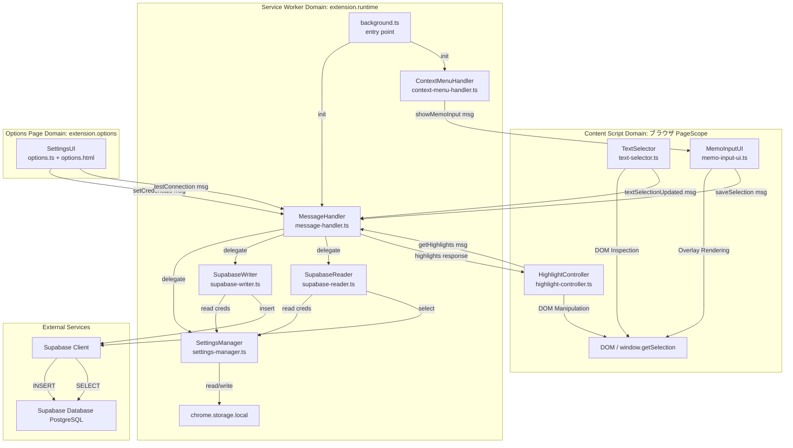
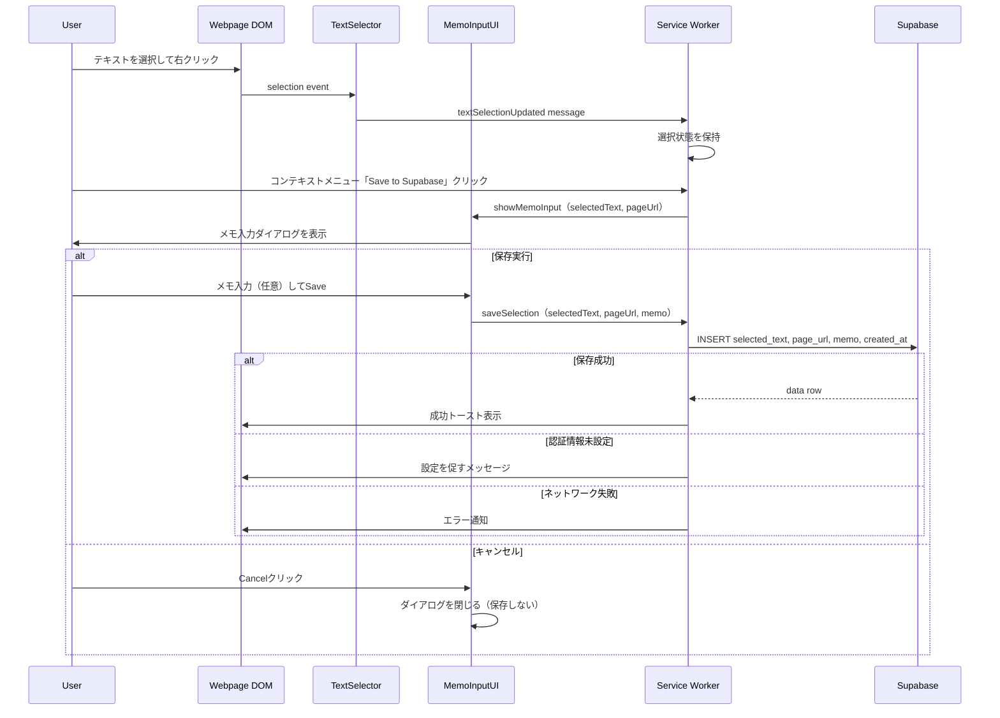
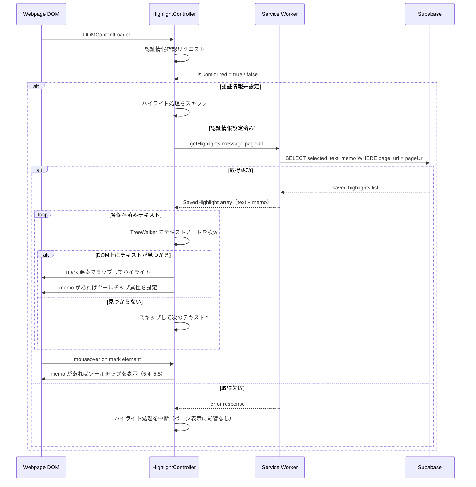

# Design Document

## Overview

本設計は、ブラウザ（Chrome）でWebページを閲覧するユーザーが、重要なテキストを選択してコンテキストメニューから「Save to Supabase」を実行するだけで、そのURLと選択テキストが自動的にユーザー自身のSupabaseプロジェクトに記録されることを実現します。保存時には任意のメモを付加でき、記録の背景や感想を残せます。さらに、過去に保存したテキストを含むページを開いた際に、該当箇所が自動的にハイライト表示され、メモが設定されている場合はホバー時にツールチップで表示されます。

拡張機能は5つの主要な領域（Content Script、Service Worker、Options Page、Highlight機能、MemoInput機能）に分かれており、以下の責務を明確に分離しています：
- **Content Script（TextSelector）**: ページ上のテキスト選択検知と通知
- **Content Script（MemoInputUI）**: メモ入力オーバーレイUIの表示と保存メッセージ送信
- **Content Script（HighlightController）**: 保存済みテキストのDOM上ハイライト表示とメモツールチップ表示
- **Service Worker**: 拡張機能API・ストレージ・Supabase通信（読み書き）の一元管理
- **Options Page**: ユーザーによるSupabase認証情報の入力・保存

### Goals
- Webブログ読者が読み進める中で重要なテキストを素早く記録できる
- テキスト保存時に任意のメモを付加して記録の背景・感想を残せる
- 記録したテキストはユーザー自身のSupabaseプロジェクトに直接蓄積される
- 認証情報の設定は簡単で、セキュアに保管される
- ユーザーフィードバック（成功/エラー）は明確に提示される
- 過去に保存したテキストをページ上でひと目で把握でき、メモもホバーで確認できる

### Non-Goals
- 記録したテキストの可視化・検索・分析機能
- Supabase以外のバックエンドへの対応
- モバイルアプリケーション
- Supabaseプロジェクトの自動作成・テーブル自動生成
- 複数デバイス間の同期
- ハイライトのスタイル（色・太さ等）のユーザーカスタマイズ
- 保存後のメモ編集・削除機能

## Boundary Commitments

### This Spec Owns
- ブラウザ上のテキスト選択検知とコンテキストメニュー統合
- メモ入力オーバーレイUIの表示・ユーザー入力収集・保存トリガー
- 選択テキスト・ページURL・メモ（任意）・タイムスタンプの Supabase への INSERT 操作
- ページロード時の保存済みテキスト取得（Supabase SELECT）とDOM上ハイライト表示
- ハイライト要素へのホバー時メモツールチップ表示
- ユーザー設定画面（Options Page）での Supabase 認証情報の入力・保存・疎通確認
- 保存成功/失敗時のユーザーフィードバック表示
- Chrome Storage API を用いた認証情報の永続化

### Out of Boundary
- Supabase 側のテーブルスキーマ設計・作成（ユーザー責務）
- Row Level Security (RLS) ポリシーの定義（ユーザー責務）
- 保存後のメモ編集・削除
- 記録したデータの検索・可視化・分析
- 複数ユーザーの認可管理
- 拡張機能の自動アップデート、バージョン管理（Chrome Web Store運用）

### Allowed Dependencies
- `@supabase/supabase-js` (v2.39+) — Supabase クライアント（INSERT/SELECT）
- Chrome Runtime / Storage / ContextMenus API — Manifest V3 標準
- TypeScript / modern JavaScript (ES2020+)
- ブラウザ標準 DOM API（TreeWalker、Range）— ハイライト実装用

### Revalidation Triggers
以下の変更が行われた場合、本設計に依存する他フェーズ・スペックの再検証が必要：
- Supabase の API スキーマ変更（ライブラリ要件の更新）
- Chrome Extension Manifest API の非互換変更
- 認証方法の変更（anon key → User Auth への移行）
- テーブル構造の変更（`selected_text`・`page_url`・`memo` カラム名変更）
- ハイライト表示に使用する CSS クラス名の変更
- `SavedHighlight` インターフェース形状の変更（`HighlightController` と `SupabaseReader` 間の共有型）

---

## Architecture

### Architecture Pattern & Boundary Map



**Architecture Integration**:
- **Selected Pattern**: Content Script + Service Worker 分離モデル（既存パターン踏襲）
- **Domain Boundaries**:
  - Content Script Domain: テキスト選択・URL取得、メモ入力UI、DOM ハイライト操作
  - Service Worker Domain: 拡張機能 API・Supabase 通信（INSERT/SELECT）・ストレージ管理
  - Options Page Domain: ユーザー設定入力
- **New Components Rationale**:
  - MemoInputUI: DOM 操作（オーバーレイ表示）はページコンテキスト専用のため Content Script に追加。保存メッセージを SW へ送信する薄いUI層
  - HighlightController: 既存コンポーネントを拡張してツールチップ表示を追加
- **Save Flow Change**: `ContextMenuHandler` はクリック時に直接 `SupabaseWriter` を呼ばず、`showMemoInput` メッセージを Content Script へ送信。実際の保存は `MemoInputUI` からの `saveSelection` メッセージで `MessageHandler` 経由で実行される

### Technology Stack

| Layer | Choice / Version | Role in Feature | Notes |
|-------|------------------|-----------------|-------|
| Extension Framework | Chrome Extensions Manifest V3 | Context menu, storage, messaging | 最新セキュリティ標準 |
| JavaScript | TypeScript + ES2020+ | 型安全実装、async/await | ES2020 コンパイル対象 |
| Supabase Client | @supabase/supabase-js v2.39+ | INSERT・SELECT 操作 | 公式クライアント、型安全 |
| Storage | Chrome Storage API local | Supabase 認証情報の永続化 | 10 MB 容量、拡張機能スコープ |
| DOM API | Browser native TreeWalker + Range | ハイライト DOM 操作・ツールチップ表示 | ライブラリ不要 |
| Build Tool | webpack / esbuild | Content Script と SW を別バンドル | Manifest V3 複数エントリポイント |

---

## File Structure Plan

### Directory Structure

```
reading-web-supporter/
├── src/
│   ├── content/
│   │   ├── text-selector.ts           # Content Script: テキスト選択検知・通知
│   │   ├── text-selector.test.ts
│   │   ├── memo-input-ui.ts           # Content Script: メモ入力オーバーレイUI (新規)
│   │   ├── memo-input-ui.test.ts
│   │   ├── highlight-controller.ts    # Content Script: ハイライト表示・メモツールチップ (更新)
│   │   └── highlight-controller.test.ts
│   │
│   ├── service-worker/
│   │   ├── background.ts              # Service Worker エントリポイント
│   │   ├── context-menu-handler.ts    # Context Menu API 統合 (更新: showMemoInput送信)
│   │   ├── supabase-writer.ts         # Supabase INSERT 操作 (更新: memo対応)
│   │   ├── supabase-reader.ts         # Supabase SELECT 操作 (更新: memo取得)
│   │   ├── settings-manager.ts        # Chrome storage 認証情報管理
│   │   ├── message-handler.ts         # Runtime メッセージルーティング (更新)
│   │   └── *.test.ts
│   │
│   ├── options/
│   │   ├── options.html               # 設定 UI
│   │   ├── options.ts                 # 設定ページロジック
│   │   └── options.css
│   │
│   ├── types/
│   │   └── types.ts                   # 共有 TypeScript 型定義 (更新: SavedHighlight, memo追加)
│   │
│   └── utils/
│       ├── logger.ts
│       └── error-handler.ts
│
├── public/
│   ├── manifest.json                  # Chrome extension manifest v3
│   └── icons/
│
├── test/
│   └── integration/
│
├── webpack.config.js
├── tsconfig.json
└── package.json
```

### Modified Files
- `src/types/types.ts` — `SavedHighlight` 型追加、`SaveTextOptions` に `memo?` 追加、`HighlightsResponse.texts` を `highlights` に変更、`ExtensionMessage` に `showMemoInput` 追加
- `src/service-worker/context-menu-handler.ts` — 保存トリガーを `SupabaseWriter` 直接呼び出しから `showMemoInput` メッセージ送信へ変更
- `src/service-worker/supabase-writer.ts` — `SaveTextOptions.memo` を INSERT に含める
- `src/service-worker/supabase-reader.ts` — `memo` カラムを SELECT に追加、戻り値を `SavedHighlight[]` に変更
- `src/service-worker/message-handler.ts` — `showMemoInput` ルーティング追加
- `src/content/highlight-controller.ts` — `SavedHighlight[]` 受信対応、ツールチップ表示追加

---

## System Flows

### Primary Flow: Text Selection → Memo Input → Save to Supabase



**Flow Decisions**:
- `ContextMenuHandler` はクリック時に `chrome.tabs.sendMessage` で `showMemoInput` を Content Script へ送信
- メモ入力は任意（空のまま Save しても保存される）
- Cancel 時は保存処理を実行しない

### New Flow: Page Load → Highlight Saved Texts → Tooltip on Hover



**Flow Decisions**:
- ツールチップは `<mark>` 要素の `mouseover`/`mouseout` イベントで表示/非表示を切り替え
- memo が未入力（空文字 or null）の場合、ツールチップは表示しない（5.5）
- ハイライト処理は `DOMContentLoaded` 後に実行（動的コンテンツへの対応は将来スコープ）

---

## Requirements Traceability

| Requirement | Summary | Components | Interfaces | Flows |
|---|---|---|---|---|
| 1.1 | テキスト選択後、右クリックメニューに保存オプション表示 | TextSelector, ContextMenuHandler | TextSelectionMessage | Primary Flow |
| 1.2 | 保存操作実行時、URL + テキストを Supabase 送信 | MemoInputUI, SupabaseWriter | SaveTextOptions | Primary Flow |
| 1.3 | 保存成功時にユーザーフィードバック表示 | SupabaseWriter, ErrorHandler | SaveResult | Primary Flow (Success) |
| 1.4 | テキスト未選択時に保存操作を無効化/エラー表示 | ContextMenuHandler, ErrorHandler | TextSelectionMessage | Primary Flow (Error) |
| 2.1 | 選択テキスト・URL・日時を Supabase テーブルへ記録 | SupabaseWriter | SaveTextOptions | Primary Flow |
| 2.2 | Supabase 書き込み失敗時にエラーメッセージ表示 | SupabaseWriter, ErrorHandler | SaveResult | Primary Flow (Error) |
| 2.3 | 認証情報未設定時に設定促進メッセージ表示 | SettingsManager, ErrorHandler | SettingsManagerService | Primary Flow (Error) |
| 3.1 | Supabase 認証情報入力・保存できる設定画面 | SettingsUI | Settings Form | Settings Configuration |
| 3.2 | 保存時に Supabase 疎通確認 | SettingsManager, SupabaseWriter | testConnection | Settings Configuration |
| 3.3 | 認証情報をブラウザセキュアストレージに永続化 | SettingsManager | StorageState | Settings Persistence |
| 3.4 | 認証情報変更時に即座に反映 | SettingsManager | Storage Event | Settings Persistence |
| 3.5 | 認証情報無効時にエラーメッセージ表示 | SettingsManager, SupabaseWriter, ErrorHandler | SaveResult | Settings Configuration (Error) |
| 4.1 | ページロード時、保存済みテキストを Supabase から取得 | HighlightController, SupabaseReader | GetHighlightsMessage | Highlight Flow |
| 4.2 | 保存済みテキストをページ上でハイライト表示 | HighlightController | HighlightsResponse | Highlight Flow |
| 4.3 | 複数の保存済みテキストをすべてハイライト表示 | HighlightController | HighlightsResponse | Highlight Flow |
| 4.4 | DOM 上に見つからない場合はスキップして継続 | HighlightController | — | Highlight Flow |
| 4.5 | Supabase 取得失敗時はページ表示を妨げず中断 | HighlightController, SupabaseReader | HighlightsResponse | Highlight Flow |
| 4.6 | 認証情報未設定時はハイライト取得処理を実行しない | HighlightController, SettingsManager | isConfigured | Highlight Flow |
| 5.1 | 保存操作実行時にメモ入力UIを表示 | MemoInputUI, ContextMenuHandler | ShowMemoInputMessage | Primary Flow |
| 5.2 | メモ・選択テキスト・URL・日時を Supabase へ書き込む | MemoInputUI, SupabaseWriter | SaveTextOptions | Primary Flow |
| 5.3 | メモ入力は任意（メモなしでも保存可能） | MemoInputUI, SupabaseWriter | SaveTextOptions.memo | Primary Flow |
| 5.4 | ハイライトホバー時にメモをツールチップ表示 | HighlightController | SavedHighlight | Highlight Flow |
| 5.5 | メモ未入力時はツールチップ表示を省略 | HighlightController | SavedHighlight.memo | Highlight Flow |

---

## Components and Interfaces

### Component Summary

| Component | Domain/Layer | Intent | Req Coverage | Key Dependencies (P0/P1) | Contracts |
|-----------|--------------|--------|--------------|--------------------------|-----------|
| TextSelector | Content Script | テキスト選択状態の監視と SW への通知 | 1.1, 1.4 | Page DOM (P0) | Service |
| MemoInputUI | Content Script | メモ入力オーバーレイUIの表示と保存メッセージ送信 | 5.1, 5.2, 5.3 | MessageHandler (P0), DOM (P0) | Service |
| HighlightController | Content Script | 保存済みテキストのハイライト表示・メモツールチップ表示 | 4.1–4.6, 5.4, 5.5 | MessageHandler (P0), DOM (P0) | Service |
| ContextMenuHandler | Service Worker | Chrome Context Menu API 統合・MemoInputUI起動 | 1.1, 1.3, 1.4 | TextSelector (P0), ErrorHandler (P1) | Service |
| SupabaseWriter | Service Worker | Supabase INSERT と error handling | 1.2, 1.3, 2.1, 2.2, 5.2, 5.3 | @supabase/supabase-js (P0), SettingsManager (P0) | Service |
| SupabaseReader | Service Worker | Supabase SELECT（保存済みテキスト＋メモ取得） | 4.1, 4.5 | @supabase/supabase-js (P0), SettingsManager (P0) | Service |
| SettingsManager | Service Worker | Chrome storage 認証情報管理 | 2.3, 3.1–3.5, 4.6 | chrome.storage (P0), SupabaseWriter (P0) | Service, State |
| MessageHandler | Service Worker | Content Script ↔ SW メッセージルーティング | 1.1, 1.2, 4.1, 5.1 | chrome.runtime (P0) | Service |
| ErrorHandler | Utils | ユーザー向けエラーメッセージ | 1.3, 1.4, 2.2, 2.3, 3.5 | MessageHandler (P1) | Service |
| SettingsUI | Options Page | Supabase 認証情報入力フォーム | 3.1, 3.2 | SettingsManager (P0) | State |

---

### Content Script Domain

#### TextSelector
（設計変更なし。要件1.1, 1.4 をカバー。）

##### Service Interface
```typescript
interface TextSelectionMessage {
  type: 'textSelectionUpdated';
  payload: {
    selectedText: string;
    pageUrl: string;
    hasSelection: boolean;
  };
}
```

---

#### MemoInputUI
| Field | Detail |
|-------|--------|
| Intent | メモ入力オーバーレイUI の表示・ユーザー入力収集・保存メッセージの送信 |
| Requirements | 5.1, 5.2, 5.3 |

**Responsibilities & Constraints**
- `showMemoInput` メッセージ受信時にページ上にオーバーレイダイアログを表示する（5.1）
- 選択テキストのプレビューと `<textarea>` によるメモ入力フィールドを提供する
- Save ボタン押下時に `saveSelection` メッセージを SW へ送信する（memo は空文字 or 入力値）（5.2, 5.3）
- Cancel ボタン押下時はダイアログを閉じ、保存処理を実行しない
- オーバーレイは最前面に表示し、ページ操作をブロックしない（背景クリックで Cancel と同等の動作）
- オーバーレイのスタイルは Shadow DOM またはユニーク CSS クラスで既存ページスタイルと分離する

**Dependencies**
- Inbound: ContextMenuHandler → MessageHandler — `showMemoInput` メッセージ (P0)
- Outbound: MessageHandler — `saveSelection` メッセージ（memo含む） (P0)
- Outbound: Page DOM — オーバーレイ要素の挿入 (P0)

**Contracts**: Service [ ✓ ] / API [ ] / Event [ ] / Batch [ ] / State [ ]

##### Service Interface
```typescript
interface ShowMemoInputMessage {
  type: 'showMemoInput';
  payload: {
    selectedText: string;
    pageUrl: string;
  };
}

// 保存時に送信（SaveTextOptions の memo は任意）
interface SaveTextOptions {
  selectedText: string;
  pageUrl: string;
  memo?: string;           // 追加: 未入力時は undefined
  timestamp: ISO8601;
}
```

**Implementation Notes**
- オーバーレイは `<div>` 要素を `document.body` に append し、`position: fixed; z-index: 2147483647` で最前面表示
- Shadow DOM を使用してページのグローバル CSS による影響を排除する
- `chrome.runtime.sendMessage` で SW へ `saveSelection` を送信後、ダイアログを自動的に閉じる

---

#### HighlightController
| Field | Detail |
|-------|--------|
| Intent | ページロード時に保存済みテキストをSupabaseから取得し、DOM上にハイライト表示する。メモがある場合はホバー時にツールチップで表示する |
| Requirements | 4.1, 4.2, 4.3, 4.4, 4.5, 4.6, 5.4, 5.5 |

**Responsibilities & Constraints**
- `DOMContentLoaded` イベント後に起動し、認証情報の設定状態を確認する（4.6）
- Service Worker へ `getHighlights` メッセージを送信し、保存済みテキストとメモの一覧を取得する（4.1）
- 取得した各 `SavedHighlight` に対して DOM TreeWalker でテキストノードを検索し、一致箇所を `<mark>` 要素でラップする（4.2, 4.3）
- DOM 上に見つからないテキストはスキップして残りを継続する（4.4）
- Supabase からの取得失敗時はサイレント中断する（4.5）
- `memo` が空文字列でない場合、`<mark>` 要素に `data-memo` 属性を設定し、`mouseover`/`mouseout` イベントでツールチップを表示/非表示する（5.4）
- `memo` が未設定（undefined/null/空文字）の場合、ツールチップを表示しない（5.5）

**Dependencies**
- Inbound: Page DOM — `DOMContentLoaded` イベント (P0)
- Outbound: MessageHandler — `getHighlights` メッセージ (P0)
- Outbound: Page DOM — `<mark>` 要素の挿入・ツールチップ表示 (P0)

**Contracts**: Service [ ✓ ] / API [ ] / Event [ ] / Batch [ ] / State [ ]

##### Service Interface
```typescript
interface SavedHighlight {
  text: string;
  memo?: string;           // 追加: 保存時に入力されたメモ（任意）
}

interface GetHighlightsMessage {
  type: 'getHighlights';
  payload: {
    pageUrl: string;
  };
}

interface HighlightsResponse {
  success: boolean;
  highlights?: SavedHighlight[];   // 変更: texts?: string[] → highlights?: SavedHighlight[]
  error?: {
    code: 'NO_CREDENTIALS' | 'NETWORK_ERROR' | 'DB_ERROR' | 'UNKNOWN';
    message: string;
  };
}
```

**Implementation Notes**
- TreeWalker でテキストノードを走査: `document.createTreeWalker(document.body, NodeFilter.SHOW_TEXT)`
- 一致箇所の分割には `Range.splitText()` を使用し、`<mark class="reading-support-highlight" data-memo="...">` でラップ
- ツールチップは `<div class="reading-support-tooltip">` を DOM に一つ保持し、位置を動的に更新する（都度生成しない）
- DOM 操作は `requestAnimationFrame` 内で実行してメインスレッドのブロックを最小化

---

### Service Worker Domain

#### ContextMenuHandler
| Field | Detail |
|-------|--------|
| Intent | Chrome Context Menu API 統合。クリック時に MemoInputUI を起動する |
| Requirements | 1.1, 1.3, 1.4, 5.1 |

**Responsibilities & Constraints**
- 既存の `chrome.contextMenus.create()` による「Save to Supabase」メニュー項目登録は維持
- `onClicked` イベント受信時、`SupabaseWriter.save()` を直接呼ぶのではなく `chrome.tabs.sendMessage(tabId, { type: 'showMemoInput', payload: { selectedText, pageUrl } })` を送信する（5.1 対応変更）
- 未選択時はメニューを disabled 状態に保つ（1.4）

**Dependencies**
- Inbound: TextSelector — `textSelectionUpdated` メッセージ（選択状態保持用） (P0)
- Outbound: chrome.tabs — `showMemoInput` メッセージを Content Script へ送信 (P0)

**Contracts**: Service [ ✓ ] / API [ ] / Event [ ] / Batch [ ] / State [ ]

---

#### SupabaseWriter
| Field | Detail |
|-------|--------|
| Intent | Supabase へのデータ INSERT と error handling を一元管理 |
| Requirements | 1.2, 1.3, 2.1, 2.2, 5.2, 5.3 |

**Responsibilities & Constraints**
- `SaveTextOptions` の `memo` フィールドを INSERT に含める（memo が undefined の場合は NULL として挿入）（5.2, 5.3）
- exponential backoff（1s, 2s, 4s）で最大 3 回リトライ

**Dependencies**
- Inbound: MessageHandler — `saveSelection` メッセージ (P0)
- Inbound: SettingsManager — Supabase 認証情報 (P0)
- Outbound: @supabase/supabase-js — insert operation (P0)

**Contracts**: Service [ ✓ ] / API [ ] / Event [ ] / Batch [ ] / State [ ]

##### Service Interface
```typescript
interface SaveTextOptions {
  selectedText: string;
  pageUrl: string;
  memo?: string;           // 追加: 未入力時は undefined → DB に NULL で保存
  timestamp: ISO8601;
}

interface SaveResult {
  success: boolean;
  data?: { id: string; created_at: ISO8601 };
  error?: {
    code: 'NO_CREDENTIALS' | 'AUTH_FAILED' | 'NETWORK_ERROR' | 'DB_ERROR' | 'UNKNOWN';
    message: string;
    recoveryHint: string;
  };
}

interface SupabaseWriterService {
  save(options: SaveTextOptions): Promise<SaveResult>;
  testConnection(): Promise<{ success: boolean; message: string }>;
}
```

---

#### SupabaseReader
| Field | Detail |
|-------|--------|
| Intent | 指定URLに対応する保存済みテキストとメモを Supabase から SELECT して返す |
| Requirements | 4.1, 4.5 |

**Responsibilities & Constraints**
- `selected_text` に加えて `memo` カラムも SELECT する（5.4 対応）
- 戻り値の型を `string[]` から `SavedHighlight[]` に変更
- 取得失敗時は `success: false` の `HighlightsResponse` を返す（例外をスローしない）

**Dependencies**
- Inbound: MessageHandler — `getHighlights` メッセージ (P0)
- Inbound: SettingsManager — Supabase 認証情報 (P0)
- Outbound: @supabase/supabase-js — select operation (P0)

**Contracts**: Service [ ✓ ] / API [ ] / Event [ ] / Batch [ ] / State [ ]

##### Service Interface
```typescript
interface FetchHighlightsOptions {
  pageUrl: string;
}

interface SupabaseReaderService {
  fetchSavedTexts(options: FetchHighlightsOptions): Promise<HighlightsResponse>;
}
```

**Preconditions**:
- SettingsManager に Supabase URL + anon key が設定済み
- Supabase テーブル `readings` に `selected_text`・`page_url`・`memo` カラムが存在

**Postconditions**:
- 成功: `highlights` に `SavedHighlight` の配列（0件の場合は空配列）
- 失敗: `success: false` と `error` オブジェクト

**Implementation Notes**
- クエリ変更: `supabase.from('readings').select('selected_text, memo').eq('page_url', pageUrl)`
- RLS が SELECT を拒否する場合は `AUTH_FAILED` として扱う

---

#### SettingsManager
（設計変更なし。要件2.3, 3.1–3.5, 4.6 をカバー。）

---

#### MessageHandler
| Field | Detail |
|-------|--------|
| Intent | Content Script ↔ Service Worker 間のメッセージルーティングと request/response 管理 |
| Requirements | 1.1, 1.2, 4.1, 5.1 |

**Responsibilities & Constraints**
- 既存ハンドラに加え、`showMemoInput` の Content Script へのルーティングを追加（`chrome.tabs.sendMessage` 経由）
- `saveSelection` ハンドラは `SaveTextOptions`（memo含む）を受け取り `SupabaseWriter.save()` へ委譲

**Dependencies**（追加分）
- Outbound: chrome.tabs — `showMemoInput` を Content Script へ配信 (P0)

##### Service Interface（追加分）
```typescript
type ExtensionMessage =
  | TextSelectionMessage
  | { type: 'getSelection' }
  | { type: 'saveSelection'; payload: SaveTextOptions }    // memo? を含む
  | { type: 'getCredentials' }
  | { type: 'setCredentials'; payload: SupabaseCredentials }
  | { type: 'testConnection' }
  | { type: 'getHighlights'; payload: { pageUrl: string } }
  | { type: 'showMemoInput'; payload: { selectedText: string; pageUrl: string } };  // 追加
```

---

### Options Page Domain

#### SettingsUI
（設計変更なし。要件3.1, 3.2 をカバー。）

---

## Data Models

### Domain Model

```
Aggregate: ReadingRecord
  - Entity: id (UUID)
  - Value Objects:
    - selectedText: string (non-empty)
    - pageUrl: string (URL)
    - memo: string (optional, ユーザーのメモ・感想)
    - timestamp: ISO8601
  - Business Invariants:
    - selectedText と pageUrl は同時に記録される
    - memo は任意（null 許容）
    - 記録日時は自動生成（ユーザー入力なし）
```

### Logical Data Model

**Table: readings**

| Column | Type | Constraints | Notes |
|--------|------|-------------|-------|
| id | UUID | PRIMARY KEY, DEFAULT uuid() | 自動生成 ID |
| selected_text | TEXT | NOT NULL | ユーザーが選択したテキスト |
| page_url | VARCHAR(2048) | NOT NULL | 選択時のページ URL |
| memo | TEXT | NULL | ユーザーが付加したメモ（任意） |
| created_at | TIMESTAMP | NOT NULL, DEFAULT NOW() | 記録日時 |

**Indexes**:
- `(page_url, created_at DESC)` — URL別・時系列ソート（ハイライト取得クエリの高速化）

### Physical Data Model

**新規テーブル作成（新規ユーザー向け）**:
```sql
CREATE TABLE readings (
  id UUID DEFAULT gen_random_uuid() PRIMARY KEY,
  selected_text TEXT NOT NULL,
  page_url VARCHAR(2048) NOT NULL,
  memo TEXT,
  created_at TIMESTAMP DEFAULT NOW() NOT NULL
);

CREATE INDEX idx_readings_page_url ON readings(page_url, created_at DESC);
ENABLE ROW LEVEL SECURITY ON readings;

-- anon role: INSERT と SELECT を許可
CREATE POLICY readings_anon_insert ON readings FOR INSERT WITH CHECK (true);
CREATE POLICY readings_anon_select ON readings FOR SELECT USING (true);
```

**既存テーブルへのマイグレーション（既存ユーザー向け）**:
```sql
ALTER TABLE readings ADD COLUMN memo TEXT;
```

> **Note**: ハイライト機能（要件4）に続き、メモ機能（要件5）の追加により `memo` カラムが必要になった。既存ユーザーは上記 ALTER TABLE を実行する必要がある。設計ドキュメント（Options Page や拡張機能の説明）でマイグレーション手順を案内すること。

---

## Error Handling

### Error Strategy

| Error Type | Source | User Action | System Response |
|---|---|---|---|
| **No Credentials** | Service Worker | 設定が必要 | Options ページを開くよう案内 |
| **Invalid URL Format** | Options Page | 再入力 | フィールドレベルエラー（クライアントバリデーション） |
| **Network Timeout** | Supabase API | 保存リトライ | "ネットワークエラー。" + 3s 後自動リトライ |
| **Auth Failed** | Supabase API | 認証情報確認 | "Supabase キーが無効です。Options で確認してください" |
| **DB Error (RLS denied)** | Supabase RLS | RLS ポリシー確認 | "アクセスが拒否されました。Supabase RLS ポリシーを確認してください" |
| **Highlight Fetch Failed** | Supabase API | 操作不要 | サイレント中断（ページ表示に影響なし） |
| **Unknown Error** | Any | リトライまたは報告 | "予期しないエラーが発生しました" + エラーコード |

### Monitoring

| Event | Logging | Metrics |
|---|---|---|
| Save initiated | INFO: "Saving selection..." | counter: save.requests |
| Save successful | INFO: "Successfully saved" | counter: save.success, histogram: save.latency_ms |
| Save failed | ERROR: "Save failed: {code}" | counter: save.failures, tag: error_type |
| Memo input shown | INFO: "Memo input shown" | counter: memo.shown |
| Memo save with content | INFO: "Saved with memo" | counter: memo.with_content |
| Highlight fetch started | INFO: "Fetching highlights for URL" | counter: highlight.requests |
| Highlight fetch successful | INFO: "Highlights fetched: {count}" | counter: highlight.success |
| Highlight fetch failed | WARN: "Highlight fetch failed: {code}" | counter: highlight.failures |

---

## Testing Strategy

### Unit Tests

1. **TextSelector**: 選択検知と debounce（設計変更なし）

2. **MemoInputUI**: メモ入力オーバーレイ UI
   - `showMemoInput` メッセージ受信時にオーバーレイが DOM に挿入されること
   - Save ボタン押下時に `saveSelection` メッセージが memo フィールド付きで送信されること
   - メモ空でも Save 可能（`memo: undefined` で送信）（5.3）
   - Cancel ボタン押下時に `saveSelection` が送信されないこと
   - 背景クリックで Cancel 動作すること

3. **HighlightController**: ハイライト DOM 操作・ツールチップ
   - 単一テキストのハイライト（`<mark>` 要素の挿入確認）
   - 複数テキストの全件ハイライト
   - DOM 上に存在しないテキストのスキップと継続
   - memo ありの場合、`<mark>` に `data-memo` 属性が設定されること（5.4）
   - mouseover 時にツールチップが表示されること（5.4）
   - memo なし（undefined/null/空文字）の場合、ツールチップが表示されないこと（5.5）
   - 認証情報未設定時の即時中断
   - Supabase 取得失敗時のサイレント中断

4. **SupabaseReader**: SELECT 操作とエラーハンドリング
   - 成功ケース（`SavedHighlight[]` の返却、text + memo を含む）
   - 0件ケース（空配列の返却）
   - memo が NULL の場合、`undefined` として返却されること
   - ネットワークエラー（`success: false` の返却）

5. **ContextMenuHandler**: MemoInputUI 起動フロー
   - `chrome.contextMenus.create()` の起動時呼び出し
   - `onClicked` イベントで `showMemoInput` メッセージが送信されること
   - `SupabaseWriter.save()` が直接呼ばれないこと
   - 未選択時の disabled 状態

6. **SupabaseWriter**: INSERT 操作とメモ対応
   - 成功 INSERT（memo あり）
   - 成功 INSERT（memo なし → NULL で挿入）
   - ネットワークエラー + リトライロジック（3回）

7. **SettingsManager**: 認証情報 CRUD と検証（設計変更なし）

### Integration Tests

1. **E2E: テキスト選択 → メモ入力 → Save → Supabase**
   - Flow: テキスト選択 → 右クリック → メニュークリック → メモダイアログ表示 → メモ入力 → DB への INSERT（memo カラム含む）を確認

2. **E2E: テキスト選択 → メモ未入力 → Save → Supabase**
   - Flow: メモ空のまま Save → DB に memo = NULL で INSERT されること

3. **E2E: ページロード → Highlight表示 → ツールチップ確認**
   - Setup: Supabase テストプロジェクトに `memo` 付きレコードを挿入
   - Flow: ページロード → `<mark>` 要素が DOM に存在 → hover でツールチップ表示

4. **E2E: ページロード → memo なしのハイライト → ツールチップなし**
   - Setup: memo = NULL のレコード
   - Flow: ページロード → `<mark>` 要素に `data-memo` なし → hover でツールチップ非表示

5. **エラーリカバリー**: 既存テスト（設計変更なし）

### E2E/UI Tests

1. **UI Flow (Save with Memo)**:
   - テキスト選択 → コンテキストメニューに「Save to Supabase」が表示される
   - 「Save to Supabase」クリック → メモ入力ダイアログが表示される
   - メモ入力して Save → 成功フィードバック表示
   - ダイアログの Cancel → 保存されない

2. **UI Flow (Highlight with Tooltip)**:
   - memo ありの保存済みテキストを含むページを開く → ハイライト表示 + hover でツールチップ
   - memo なしの保存済みテキストを含むページを開く → ハイライト表示 + hover でツールチップなし

---

## Optional Sections

### Security Considerations

**Threat Model**（更新箇所のみ）:
- **XSS via Memo**: HighlightController は `memo` を `textContent` として扱い、HTML として解釈しない。`data-memo` 属性への設定も `setAttribute` を使用して XSS を防ぐ
- **XSS via Tooltip**: ツールチップ表示は `element.textContent = memo` のみで行い、`innerHTML` は使用しない

**Authentication & Authorization**:
- Anon Key: Supabase RLS により INSERT + SELECT のみ可能（UPDATE/DELETE は deny）

### Performance & Scalability

**Target Metrics**:
- Save latency: < 2s（メモ入力 UI 表示は即時）
- Highlight fetch latency: < 1s（ページロード後）
- DOM ハイライト処理: < 100ms（通常ページの場合）
- ツールチップ表示遅延: < 16ms（1フレーム以内）

**Implementation Notes**:
- ツールチップ要素は `<mark>` ごとに生成せず、ページに1つ保持して位置を動的更新する
