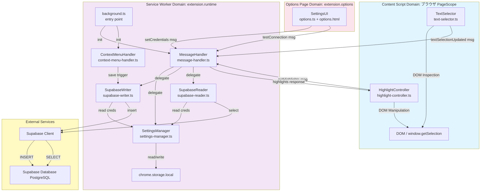
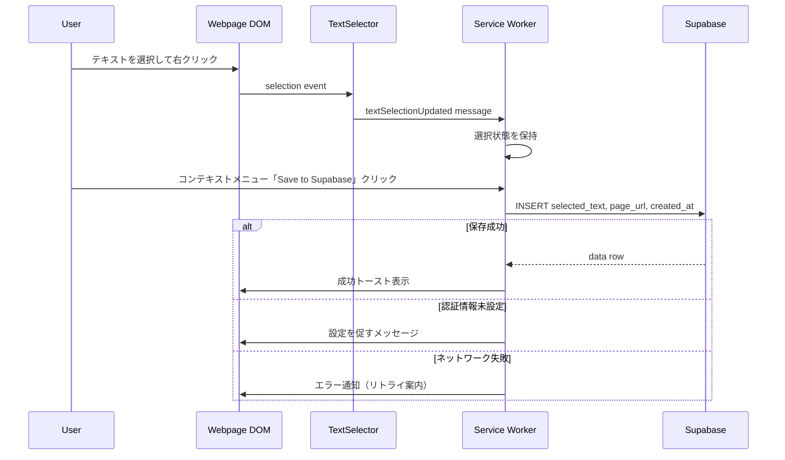
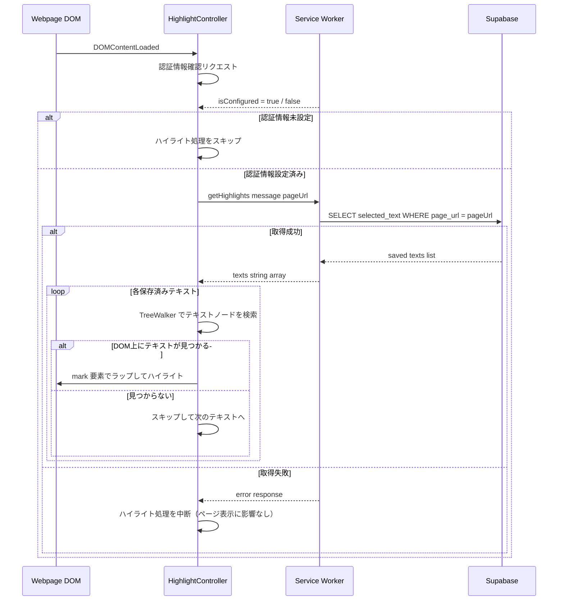

# Design Document

## Overview

本設計は、ブラウザ（Chrome）でWebページを閲覧するユーザーが、重要なテキストを選択してコンテキストメニューから「Save to Supabase」を実行するだけで、そのURLと選択テキストが自動的にユーザー自身のSupabaseプロジェクトに記録されることを実現します。さらに、過去に保存したテキストを含むページを開いた際に、該当箇所が自動的にハイライト表示され、既読箇所を即座に把握できます。

拡張機能は4つの主要な領域（Content Script、Service Worker、Options Page、Highlight機能）に分かれており、以下の責務を明確に分離しています：
- **Content Script（TextSelector）**: ページ上のテキスト選択検知と通知
- **Content Script（HighlightController）**: 保存済みテキストのDOM上ハイライト表示
- **Service Worker**: 拡張機能API・ストレージ・Supabase通信（読み書き）の一元管理
- **Options Page**: ユーザーによるSupabase認証情報の入力・保存

### Goals
- Webブログ読者が読み進める中で重要なテキストを素早く記録できる
- 記録したテキストはユーザー自身のSupabaseプロジェクトに直接蓄積される
- 認証情報の設定は簡単で、セキュアに保管される
- ユーザーフィードバック（成功/エラー）は明確に提示される
- 過去に保存したテキストをページ上でひと目で把握できる

### Non-Goals
- 記録したテキストの可視化・検索・分析機能
- Supabase以外のバックエンドへの対応
- モバイルアプリケーション
- Supabaseプロジェクトの自動作成・テーブル自動生成
- 複数デバイス間の同期

## Boundary Commitments

### This Spec Owns
- ブラウザ上のテキスト選択検知とコンテキストメニュー統合
- 選択テキスト・ページURL・タイムスタンプの Supabase への INSERT 操作
- ページロード時の保存済みテキスト取得（Supabase SELECT）とDOM上ハイライト表示
- ユーザー設定画面（Options Page）での Supabase 認証情報の入力・保存・疎通確認
- 保存成功/失敗時のユーザーフィードバック表示
- Chrome Storage API を用いた認証情報の永続化

### Out of Boundary
- Supabase 側のテーブルスキーマ設計・作成（ユーザー責務）
- Row Level Security (RLS) ポリシーの定義（ユーザー責務）
- 記録したデータの検索・可視化・分析
- 複数ユーザーの認可管理
- 拡張機能の自動アップデート、バージョン管理（Chrome Web Store運用）
- ハイライトのスタイル（色・太さ等）のユーザーカスタマイズ

### Allowed Dependencies
- `@supabase/supabase-js` (v2.39+) — Supabase クライアント（INSERT/SELECT）
- Chrome Runtime / Storage / ContextMenus API — Manifest V3 標準
- TypeScript / modern JavaScript (ES2020+)
- ブラウザ標準 DOM API（TreeWalker、Range）— ハイライト実装用

### Revalidation Triggers
以下の変更が行われた場合、本設計に依存する他フェーズ・スペックの再検証が必要：
- Supabase の API スキーマ変更（ライブラリ要件の更新）
- Chrome Extension Manifest API の非互換変更
- 認証方法の変更（anon key → User Auth への移行）
- テーブル構造の変更（`selected_text`・`page_url` カラム名変更）
- ハイライト表示に使用する CSS クラス名の変更

---

## Architecture

### Architecture Pattern & Boundary Map



**Architecture Integration**:
- **Selected Pattern**: Content Script + Service Worker 分離モデル（既存パターン踏襲）
- **Domain Boundaries**:
  - Content Script Domain: テキスト選択・URL取得、DOM ハイライト操作
  - Service Worker Domain: 拡張機能 API・Supabase 通信（INSERT/SELECT）・ストレージ管理
  - Options Page Domain: ユーザー設定入力
- **New Components Rationale**:
  - HighlightController: DOM 操作（ハイライト）はページコンテキスト専用のため Content Script に追加
  - SupabaseReader: INSERT と SELECT を責任分離（既存 SupabaseWriter パターンに倣う）
- **Existing Patterns Preserved**: TextSelector/MessageHandler/SupabaseWriter の既存パターンを踏襲

### Technology Stack

| Layer | Choice / Version | Role in Feature | Notes |
|-------|------------------|-----------------|-------|
| Extension Framework | Chrome Extensions Manifest V3 | Context menu, storage, messaging | 最新セキュリティ標準 |
| JavaScript | TypeScript + ES2020+ | 型安全実装、async/await | ES2020 コンパイル対象 |
| Supabase Client | @supabase/supabase-js v2.39+ | INSERT・SELECT 操作 | 公式クライアント、型安全 |
| Storage | Chrome Storage API local | Supabase 認証情報の永続化 | 10 MB 容量、拡張機能スコープ |
| DOM API | Browser native TreeWalker + Range | ハイライト DOM 操作 | ライブラリ不要 |
| Build Tool | webpack / esbuild | Content Script と SW を別バンドル | Manifest V3 複数エントリポイント |

---

## File Structure Plan

### Directory Structure

```
reading-web-supporter/
├── src/
│   ├── content/
│   │   ├── text-selector.ts           # Content Script: テキスト選択検知・通知
│   │   ├── text-selector.test.ts
│   │   ├── highlight-controller.ts    # Content Script: 保存済みテキストのDOM上ハイライト (新規)
│   │   └── highlight-controller.test.ts
│   │
│   ├── service-worker/
│   │   ├── background.ts              # Service Worker エントリポイント
│   │   ├── context-menu-handler.ts    # Context Menu API 統合
│   │   ├── supabase-writer.ts         # Supabase INSERT 操作
│   │   ├── supabase-reader.ts         # Supabase SELECT 操作（保存済みテキスト取得）(新規)
│   │   ├── settings-manager.ts        # Chrome storage 認証情報管理
│   │   ├── message-handler.ts         # Runtime メッセージルーティング（getHighlights 追加）
│   │   └── *.test.ts                  # 各コンポーネントのユニットテスト
│   │
│   ├── options/
│   │   ├── options.html               # 設定 UI
│   │   ├── options.ts                 # 設定ページロジック
│   │   └── options.css
│   │
│   ├── types/
│   │   └── types.ts                   # 共有 TypeScript 型定義（getHighlights 型追加）
│   │
│   └── utils/
│       ├── logger.ts
│       └── error-handler.ts
│
├── public/
│   ├── manifest.json                  # Chrome extension manifest v3
│   └── icons/
│
├── test/
│   └── integration/
│
├── webpack.config.js
├── tsconfig.json
└── package.json
```

### Modified Files
- `src/types/types.ts` — `GetHighlightsMessage`・`HighlightsResponse`・`ExtensionMessage` 共用体型を追加
- `src/service-worker/message-handler.ts` — `getHighlights` メッセージハンドラを追加

---

## System Flows

### Primary Flow: Text Selection & Save to Supabase



### New Flow: Page Load → Highlight Saved Texts



**Flow Decisions**:
- ハイライト処理は `DOMContentLoaded` 後に実行（動的コンテンツへの対応は将来スコープ）
- Supabase 通信は Service Worker で実行（認証情報を Content Script に渡さない）
- 取得失敗・テキスト未発見はサイレント処理（ページ閲覧体験を妨げない）

---

## Requirements Traceability

| Requirement | Summary | Components | Interfaces | Flows |
|---|---|---|---|---|
| 1.1 | テキスト選択後、右クリックメニューに保存オプション表示 | TextSelector, ContextMenuHandler | TextSelectionMessage | Primary Flow |
| 1.2 | 保存操作実行時、URL + テキストを Supabase 送信 | SupabaseWriter | SaveTextOptions | Primary Flow |
| 1.3 | 保存成功時にユーザーフィードバック表示 | SupabaseWriter, ErrorHandler | SaveResult | Primary Flow (Success) |
| 1.4 | テキスト未選択時に保存操作を無効化/エラー表示 | ContextMenuHandler, ErrorHandler | TextSelectionMessage | Primary Flow (Error) |
| 2.1 | 選択テキスト・URL・日時を Supabase テーブルへ記録 | SupabaseWriter | SaveTextOptions | Primary Flow |
| 2.2 | Supabase 書き込み失敗時にエラーメッセージ表示 | SupabaseWriter, ErrorHandler | SaveResult | Primary Flow (Error) |
| 2.3 | 認証情報未設定時に設定促進メッセージ表示 | SettingsManager, ErrorHandler | SettingsManagerService | Primary Flow (Error) |
| 3.1 | Supabase 認証情報入力・保存できる設定画面 | SettingsUI | Settings Form | Settings Configuration |
| 3.2 | 保存時に Supabase 疎通確認 | SettingsManager, SupabaseWriter | testConnection | Settings Configuration |
| 3.3 | 認証情報をブラウザセキュアストレージに永続化 | SettingsManager | StorageState | Settings Persistence |
| 3.4 | 認証情報変更時に即座に反映 | SettingsManager | Storage Event | Settings Persistence |
| 3.5 | 認証情報無効時にエラーメッセージ表示 | SettingsManager, SupabaseWriter, ErrorHandler | SaveResult | Settings Configuration (Error) |
| 4.1 | ページロード時、保存済みテキストを Supabase から取得 | HighlightController, SupabaseReader | GetHighlightsMessage | Highlight Flow |
| 4.2 | 保存済みテキストをページ上でハイライト表示 | HighlightController | HighlightsResponse | Highlight Flow |
| 4.3 | 複数の保存済みテキストをすべてハイライト表示 | HighlightController | HighlightsResponse | Highlight Flow |
| 4.4 | DOM 上に見つからない場合はスキップして継続 | HighlightController | — | Highlight Flow |
| 4.5 | Supabase 取得失敗時はページ表示を妨げず中断 | HighlightController, SupabaseReader | HighlightsResponse | Highlight Flow |
| 4.6 | 認証情報未設定時はハイライト取得処理を実行しない | HighlightController, SettingsManager | isConfigured | Highlight Flow |

---

## Components and Interfaces

### Component Summary

| Component | Domain/Layer | Intent | Req Coverage | Key Dependencies (P0/P1) | Contracts |
|-----------|--------------|--------|--------------|--------------------------|-----------|
| TextSelector | Content Script | テキスト選択状態の監視と SW への通知 | 1.1, 1.4 | Page DOM (P0) | Service |
| HighlightController | Content Script | 保存済みテキストの取得とDOM上ハイライト | 4.1–4.6 | MessageHandler (P0), DOM (P0) | Service |
| ContextMenuHandler | Service Worker | Chrome Context Menu API 統合 | 1.1, 1.3, 1.4 | TextSelector (P0), ErrorHandler (P1) | Service |
| SupabaseWriter | Service Worker | Supabase INSERT と error handling | 1.2, 1.3, 2.1, 2.2 | @supabase/supabase-js (P0), SettingsManager (P0) | Service |
| SupabaseReader | Service Worker | Supabase SELECT（保存済みテキスト取得） | 4.1, 4.5 | @supabase/supabase-js (P0), SettingsManager (P0) | Service |
| SettingsManager | Service Worker | Chrome storage 認証情報管理 | 2.3, 3.1–3.5, 4.6 | chrome.storage (P0), SupabaseWriter (P0) | Service, State |
| MessageHandler | Service Worker | Content Script ↔ SW メッセージルーティング | 1.1, 1.2, 4.1 | chrome.runtime (P0) | Service |
| ErrorHandler | Utils | ユーザー向けエラーメッセージ | 1.3, 1.4, 2.2, 2.3, 3.5 | MessageHandler (P1) | Service |
| SettingsUI | Options Page | Supabase 認証情報入力フォーム | 3.1, 3.2 | SettingsManager (P0), SupabaseWriter (P0) | State |

---

### Content Script Domain

#### TextSelector
| Field | Detail |
|-------|--------|
| Intent | Content Script でテキスト選択状態を監視し、Service Worker へ通知 |
| Requirements | 1.1, 1.4 |

**Responsibilities & Constraints**
- `mouseup` / `touch` イベントでテキスト選択を検知
- 選択テキストの有無を Service Worker に通知（未選択も通知してメニュー無効化判定に使用）
- debounce（250ms）で頻繁な通知を抑止

**Dependencies**
- Inbound: Page DOM — `window.getSelection()` (P0)
- Outbound: MessageHandler — `textSelectionUpdated` メッセージ (P0)

**Contracts**: Service [ ✓ ] / API [ ] / Event [ ] / Batch [ ] / State [ ]

##### Service Interface
```typescript
interface TextSelectionMessage {
  type: 'textSelectionUpdated';
  payload: {
    selectedText: string;
    pageUrl: string;
    hasSelection: boolean;
  };
}
```

---

#### HighlightController
| Field | Detail |
|-------|--------|
| Intent | ページロード時に保存済みテキストを Supabase から取得し、DOM 上にハイライト表示する |
| Requirements | 4.1, 4.2, 4.3, 4.4, 4.5, 4.6 |

**Responsibilities & Constraints**
- `DOMContentLoaded` イベント後に起動し、認証情報の設定状態を確認する
- 認証情報が未設定の場合、処理を即座に中断する（4.6）
- Service Worker へ `getHighlights` メッセージを送信し、保存済みテキストリストを取得する（4.1）
- Supabase からの取得が失敗した場合、ページ表示を妨げずにサイレント中断する（4.5）
- 取得した各テキストに対して DOM TreeWalker でテキストノードを検索し、一致箇所を `<mark>` 要素でラップする（4.2, 4.3）
- DOM 上に見つからないテキストはスキップして、残りのテキストのハイライトを継続する（4.4）
- 注入する CSS は固定スタイル（`background: #FFFF99; color: inherit;`）

**Dependencies**
- Inbound: Page DOM — `DOMContentLoaded` イベント (P0)
- Outbound: MessageHandler — `getHighlights` メッセージ (P0)
- Outbound: Page DOM — `<mark>` 要素の挿入 (P0)

**Contracts**: Service [ ✓ ] / API [ ] / Event [ ] / Batch [ ] / State [ ]

##### Service Interface
```typescript
interface GetHighlightsMessage {
  type: 'getHighlights';
  payload: {
    pageUrl: string;   // window.location.href
  };
}

interface HighlightsResponse {
  success: boolean;
  texts?: string[];    // 保存済みテキストの配列
  error?: {
    code: 'NO_CREDENTIALS' | 'NETWORK_ERROR' | 'DB_ERROR' | 'UNKNOWN';
    message: string;
  };
}
```

**Implementation Notes**
- TreeWalker を使用してテキストノードを走査: `document.createTreeWalker(document.body, NodeFilter.SHOW_TEXT)`
- テキスト一致は完全文字列一致で検索。部分一致の場合は `String.prototype.indexOf` で位置を特定
- 一致箇所の分割には `Range.splitText()` を使用し、`<mark class="reading-support-highlight">` でラップ
- DOM 操作は `requestAnimationFrame` 内で実行してメインスレッドのブロックを最小化
- ハイライト要素の CSS は `content script` 内で `<style>` タグとして一度だけ注入

---

### Service Worker Domain

#### SupabaseWriter
| Field | Detail |
|-------|--------|
| Intent | Supabase へのデータ INSERT と error handling を一元管理 |
| Requirements | 1.2, 1.3, 2.1, 2.2 |

**Responsibilities & Constraints**
- SettingsManager から URL + key を取得して Supabase クライアントを初期化
- 選択テキスト・URL・タイムスタンプを Supabase テーブルへ insert
- ネットワーク/認証/DBエラーの種類に応じた SaveResult を返却
- exponential backoff（1s, 2s, 4s）で最大 3 回リトライ
- 重複送信対策（ローカル deduplication queue）

**Dependencies**
- Inbound: ContextMenuHandler — save trigger (P0)
- Inbound: SettingsManager — Supabase 認証情報 (P0)
- Outbound: @supabase/supabase-js — insert operation (P0)
- Outbound: ErrorHandler — error notification (P1)

**Contracts**: Service [ ✓ ] / API [ ] / Event [ ] / Batch [ ] / State [ ]

##### Service Interface
```typescript
interface SaveTextOptions {
  selectedText: string;
  pageUrl: string;
  timestamp: ISO8601;
}

interface SaveResult {
  success: boolean;
  data?: { id: string; created_at: ISO8601; };
  error?: {
    code: 'NO_CREDENTIALS' | 'AUTH_FAILED' | 'NETWORK_ERROR' | 'DB_ERROR' | 'UNKNOWN';
    message: string;
    recoveryHint: string;
  };
}

interface SupabaseWriterService {
  save(options: SaveTextOptions): Promise<SaveResult>;
  testConnection(): Promise<{ success: boolean; message: string }>;
}
```

---

#### SupabaseReader
| Field | Detail |
|-------|--------|
| Intent | 指定URLに対応する保存済みテキストを Supabase から SELECT して返す |
| Requirements | 4.1, 4.5 |

**Responsibilities & Constraints**
- SettingsManager から認証情報を取得して Supabase クライアントを初期化
- `page_url` でフィルタして `selected_text` の一覧を取得
- タイムアウト（10s）でネットワークエラーと判定
- 取得失敗時は `success: false` の `HighlightsResponse` を返す（例外をスローしない）

**Dependencies**
- Inbound: MessageHandler — `getHighlights` メッセージ (P0)
- Inbound: SettingsManager — Supabase 認証情報 (P0)
- Outbound: @supabase/supabase-js — select operation (P0)

**Contracts**: Service [ ✓ ] / API [ ] / Event [ ] / Batch [ ] / State [ ]

##### Service Interface
```typescript
interface FetchHighlightsOptions {
  pageUrl: string;
}

interface HighlightsResponse {
  success: boolean;
  texts?: string[];
  error?: {
    code: 'NO_CREDENTIALS' | 'AUTH_FAILED' | 'NETWORK_ERROR' | 'DB_ERROR' | 'UNKNOWN';
    message: string;
  };
}

interface SupabaseReaderService {
  fetchSavedTexts(options: FetchHighlightsOptions): Promise<HighlightsResponse>;
}
```

**Preconditions**:
- SettingsManager に Supabase URL + anon key が設定済み
- Supabase テーブル `readings` に `selected_text`・`page_url` カラムが存在

**Postconditions**:
- 成功: `texts` に保存済みテキストの文字列配列（0件の場合は空配列）
- 失敗: `success: false` と `error` オブジェクト

**Implementation Notes**
- クエリ: `supabase.from('readings').select('selected_text').eq('page_url', pageUrl)`
- Supabase クライアントは SupabaseWriter と同様にシングルトンパターンで管理
- RLS が SELECT を拒否する場合は `AUTH_FAILED` として扱う

---

#### SettingsManager
（既存コンポーネント。要件2.3, 3.1–3.5, 4.6 をカバー。設計変更なし。）

**Requirement 4.6 Coverage**: `isConfigured()` メソッドが HighlightController からも利用される（既存インターフェース）

---

#### MessageHandler
| Field | Detail |
|-------|--------|
| Intent | Content Script ↔ Service Worker 間のメッセージルーティングと request/response 管理 |
| Requirements | 1.1, 1.2, 4.1 |

**Responsibilities & Constraints**
- 既存の `textSelectionUpdated`・`getSelection`・`setCredentials`・`getCredentials`・`testConnection` ハンドラに加え、`getHighlights` ハンドラを追加
- `getHighlights` 受信時に SupabaseReader.fetchSavedTexts() を実行し、結果を Content Script に返却

**Dependencies**（追加分）
- Outbound: SupabaseReader — fetchSavedTexts() (P0)

**Contracts**: Service [ ✓ ] / API [ ] / Event [ ] / Batch [ ] / State [ ]

##### Service Interface（追加分）
```typescript
// types.ts の ExtensionMessage 共用体型に追加
type ExtensionMessage =
  | TextSelectionMessage
  | { type: 'getSelection' }
  | { type: 'saveSelection'; payload: SaveTextOptions }
  | { type: 'getCredentials' }
  | { type: 'setCredentials'; payload: SupabaseCredentials }
  | { type: 'testConnection' }
  | { type: 'getHighlights'; payload: { pageUrl: string } };   // 追加
```

---

### Options Page Domain

#### SettingsUI
（既存コンポーネント。設計変更なし。要件3.1, 3.2 をカバー。）

---

## Data Models

### Domain Model

```
Aggregate: ReadingRecord
  - Entity: id (UUID)
  - Value Objects:
    - selectedText: string (non-empty)
    - pageUrl: string (URL)
    - timestamp: ISO8601
  - Business Invariants:
    - selectedText と pageUrl は同時に記録される
    - 記録日時は自動生成（ユーザー入力なし）
```

### Logical Data Model

**Table: readings**

| Column | Type | Constraints | Notes |
|--------|------|-------------|-------|
| id | UUID | PRIMARY KEY, DEFAULT uuid() | 自動生成 ID |
| selected_text | TEXT | NOT NULL | ユーザーが選択したテキスト |
| page_url | VARCHAR(2048) | NOT NULL | 選択時のページ URL |
| created_at | TIMESTAMP | NOT NULL, DEFAULT NOW() | 記録日時 |

**Indexes**:
- `(page_url, created_at DESC)` — URL別・時系列ソート（ハイライト取得クエリの高速化）

**Consistency**:
- Foreign keys なし（ユーザー管理は Supabase RLS に委譲）
- Cascading rules なし

### Physical Data Model

```sql
CREATE TABLE readings (
  id UUID DEFAULT gen_random_uuid() PRIMARY KEY,
  selected_text TEXT NOT NULL,
  page_url VARCHAR(2048) NOT NULL,
  created_at TIMESTAMP DEFAULT NOW() NOT NULL
);

CREATE INDEX idx_readings_page_url ON readings(page_url, created_at DESC);
ENABLE ROW LEVEL SECURITY ON readings;

-- anon role: INSERT と SELECT を許可（ハイライト取得のため）
CREATE POLICY readings_anon_insert ON readings FOR INSERT WITH CHECK (true);
CREATE POLICY readings_anon_select ON readings FOR SELECT USING (true);
```

> **Note**: ハイライト機能（要件4）の追加により、anon role に SELECT ポリシーが必要になった。ユーザーは RLS ポリシーを更新する必要がある。

---

## Error Handling

### Error Strategy

| Error Type | Source | User Action | System Response |
|---|---|---|---|
| **No Credentials** | Service Worker | 設定が必要 | Options ページを開くよう案内 |
| **Invalid URL Format** | Options Page | 再入力 | フィールドレベルエラー（クライアントバリデーション） |
| **Network Timeout** | Supabase API | 保存リトライ | "ネットワークエラー。リトライ?" + 3s 後自動リトライ |
| **Auth Failed** | Supabase API | 認証情報確認 | "Supabase キーが無効です。Options で確認してください" |
| **DB Error (RLS denied)** | Supabase RLS | RLS ポリシー確認 | "アクセスが拒否されました。Supabase RLS ポリシーを確認してください" |
| **Highlight Fetch Failed** | Supabase API | 操作不要 | サイレント中断（ページ表示に影響なし） |
| **Unknown Error** | Any | リトライまたは報告 | "予期しないエラーが発生しました" + エラーコード |

### Error Categories and Responses

**User Errors (4xx)**:
- Invalid Supabase URL format → Options ページでフィールドバリデーション
- Missing/empty credentials → 拡張機能起動時に設定ダイアログ

**System Errors (5xx)**:
- ネットワーク失敗 → exponential backoff リトライ（3回）
- Supabase サービスダウン → graceful エラーメッセージ

**Business Logic Errors (422)**:
- RLS ポリシーで INSERT blocked → "アクセスが拒否されました" + ポリシー設定リンク
- RLS ポリシーで SELECT blocked → ハイライトをサイレントスキップ

### Monitoring

| Event | Logging | Metrics |
|---|---|---|
| Save initiated | INFO: "Saving selection..." | counter: save.requests |
| Save successful | INFO: "Successfully saved" | counter: save.success, histogram: save.latency_ms |
| Save failed | ERROR: "Save failed: {code}" | counter: save.failures, tag: error_type |
| Highlight fetch started | INFO: "Fetching highlights for URL" | counter: highlight.requests |
| Highlight fetch successful | INFO: "Highlights fetched: {count}" | counter: highlight.success |
| Highlight fetch failed | WARN: "Highlight fetch failed: {code}" | counter: highlight.failures |
| Credentials invalid | WARN: "Credentials invalid" | counter: auth.failures |

---

## Testing Strategy

### Unit Tests

1. **TextSelector**: 選択検知と debounce
   - `window.getSelection()` からの選択テキスト取得
   - debounce 動作（250ms）
   - 空の選択処理

2. **HighlightController**: ハイライト DOM 操作
   - 単一テキストのハイライト（`<mark>` 要素の挿入確認）
   - 複数テキストの全件ハイライト
   - DOM 上に存在しないテキストのスキップと継続
   - 認証情報未設定時の即時中断
   - Supabase 取得失敗時のサイレント中断

3. **SupabaseReader**: SELECT 操作とエラーハンドリング
   - 成功ケース（テキスト配列の返却）
   - 0件ケース（空配列の返却）
   - ネットワークエラー（`success: false` の返却）
   - 認証エラー（`AUTH_FAILED` コードの返却）

4. **ContextMenuHandler**: メニュー登録とクリックイベント
   - `chrome.contextMenus.create()` の起動時呼び出し
   - `onClicked` イベントで save がトリガーされること
   - 未選択時の disabled 状態

5. **SupabaseWriter**: INSERT 操作とエラーハンドリング
   - 成功 INSERT（モック Supabase）
   - ネットワークエラー + リトライロジック（3回）
   - 認証エラーハンドリング

6. **SettingsManager**: 認証情報 CRUD と検証
   - chrome.storage.local への保存/読み込み
   - 接続テスト（成功/失敗）
   - 認証情報バリデーション（URL 形式、key 長）

### Integration Tests

1. **E2E: テキスト選択 → Save → Supabase**
   - Setup: Supabase テストプロジェクト（anon key 付き）
   - Flow: テキスト選択 → 右クリック → メニュークリック → DB への INSERT を確認
   - Cleanup: テストレコードを削除

2. **E2E: ページロード → Highlight表示**
   - Setup: Supabase テストプロジェクトに事前レコードを挿入
   - Flow: ページロード → getHighlights → `<mark>` 要素がDOMに存在することを確認
   - Cleanup: テストレコードを削除

3. **設定変更 → 接続テスト → 保存**
   - Flow: 認証情報入力 → 接続テスト → 保存
   - Verify: chrome.storage.local に認証情報が格納されていること

4. **エラーリカバリー**
   - Scenario: ネットワークタイムアウト → リトライ → 成功
   - Scenario: 無効な key → エラー → 再入力 → 成功
   - Scenario: ハイライト取得失敗 → ページ表示が正常であること

### E2E/UI Tests

1. **Chrome Extension Manifest**:
   - manifest.json の構造（v3 互換）を確認
   - content_scripts の全 URL へのインジェクション確認
   - service_worker 登録確認

2. **UI Flow (Save)**:
   - テキスト選択 → コンテキストメニューに「Save to Supabase」が表示される
   - 「Save to Supabase」クリック → トースト/バッジでステータス表示
   - Options ページ読み込み → 既存認証情報がフィールドに事前入力される

3. **UI Flow (Highlight)**:
   - 保存済みテキストを含むページを開く → ハイライトが表示される
   - 保存済みテキストを含まないページを開く → ハイライトなし（エラーなし）
   - Supabase 未設定状態でページを開く → ハイライト処理なし（エラーなし）

---

## Optional Sections

### Security Considerations

**Threat Model**:
- **Code Injection**: Content Script の `eval()` 使用なし（CSP で禁止）
- **API Key Exposure**: anon key は公開前提。RLS で INSERT/SELECT 範囲を制限
- **CSRF**: `chrome.runtime.sendMessage` はオリジン検証済み
- **XSS via Highlight**: HighlightController は `textContent` のみを比較対象とし、保存済みテキストを HTML として解釈しない。`<mark>` 要素の挿入のみ行う

**Authentication & Authorization**:
- Anon Key: Supabase RLS により INSERT + SELECT のみ可能（UPDATE/DELETE は deny）
- ハイライト機能追加により、anon key に SELECT 権限が必要（ユーザーが RLS ポリシーを更新する必要あり）

**Data Protection**:
- Transport: Supabase が HTTPS 必須
- Storage: chrome.storage.local の認証情報は Chrome OS 側で暗号化
- ハイライト表示は DOM 操作のみ（外部への送信なし）

### Performance & Scalability

**Target Metrics**:
- Save latency: < 2s（ネットワーク + Supabase 処理）
- Highlight fetch latency: < 1s（ページロード後）
- DOM ハイライト処理: < 100ms（通常ページの場合）
- メモリフットプリント: < 5 MB

**Caching**:
- 認証情報: chrome.storage.local で永続化（再起動後も再取得不要）
- 保存済みテキスト: キャッシュなし（ページロード毎に Supabase から取得）

**Scaling**:
- 単一ページの保存済みテキスト件数が多い場合（100件超）は TreeWalker のパフォーマンスに注意
- 将来最適化: `requestIdleCallback` を使用して他の処理をブロックしない

